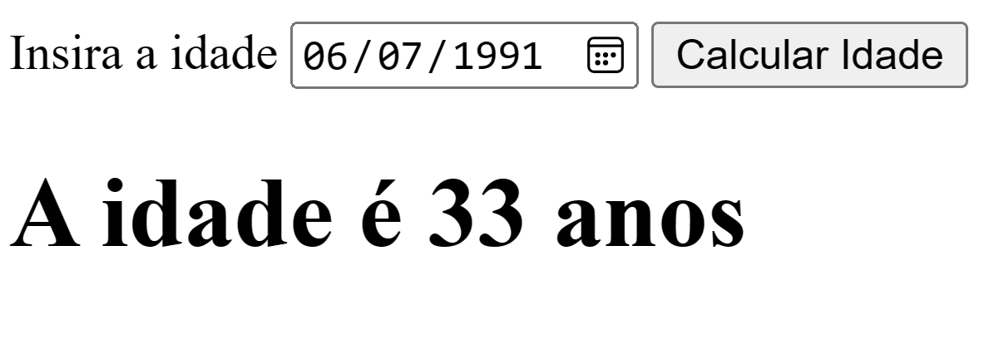

# **Desenvolvimento Web Básico**
## A2 - Parcial A3
Prof. Felipe Marx Benghi 
    
## Introdução ao JAVASCRIPT

** ATENÇÃO: TODAS OS EXERCÍCIOS DEVEM SER RESPONDIDOS USANDO JAVASCRIPT **

## Questões

1. Tema: Algoritmos em Javascript - Manipulação de Texto

    Escreva uma função que converta um texto para o formato `snake case` - bastante usado em programação em C para padronizar nomes de funções e variáveis. 
   
    Características do snake case: todas as letras minúsculas e `_` (underline) substituindo os espaços.
    
    Exemplos:
    * Entrada: "Ola TUDo beM" => Saída da "ola_tudo_bem"
    * Entrada: "essE eh O SNAKE case" => "esse_eh_o_snake_case"


1. Tema: Comparação de objetos/JSON

    Crie uma função que compare dois objetos. 
    1. Caso os dois objetos sejam idênticos, a função deve retornar `true`. Se diferentes, a função de retornar `false`.
    1. Imprime via `console.log` as chaves do JSON que são diferentes

    Exemplo de JSON:
    ```JSON
    teste = 
    {
        "NOME" : "José",
        "Idade": 38,
        "Lazer" :
        {
            "Esporte" : ["Futebol", "Basquete"],
            "Filmes"  : 
            {
                "Genero" : ["Ficção", "Drama"],
                "Décadas"  : [1980, 2000]
            }
        }
    };

    teste1 = 
    {
        "NOME" : "José",  
        "Idade": 38,   
        "Lazer" :   
        {
            "Esporte" : ["Futebol", "Basquete"],
            "Filmes"  : 
            {
                "Genero" : ["Ficção", "Drama"],
                "Décadas"  : [2000]
            }
        }
    };

    ```

1. Tema: Manipulação de DOM

    Crie uma página HTML que, utilizando Javascript, calcule a idade a partir de uma data e exiba a idade calculada na tela quando o botão for clicado:

    