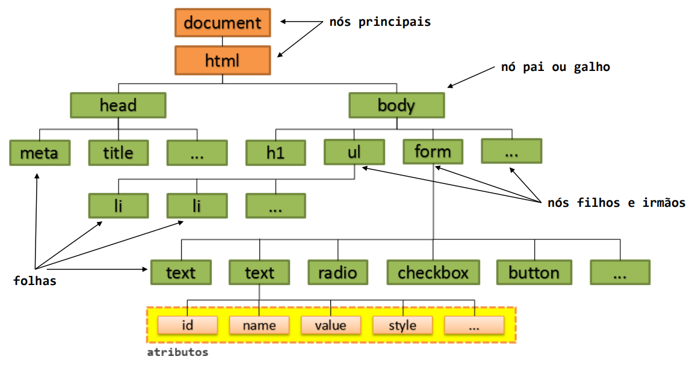
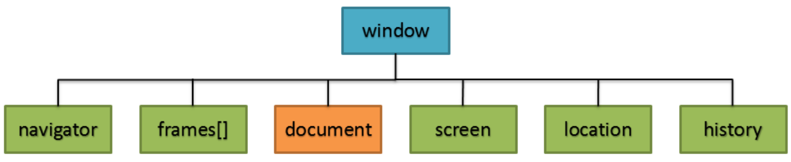

<script type="module">
  import mermaid from 'https://cdn.jsdelivr.net/npm/mermaid@10/dist/mermaid.esm.min.mjs';
  mermaid.initialize({ startOnLoad: true });
</script>

# **Desenvolvimento Web Básico**
## Aula 09 - DOM
Prof. Felipe Marx Benghi 
https://github.com/fbenghi/WebBasico2023-2


---

## Objetivos
- [ ] Acessando elementos HTML
- [ ] Editando elementos HML
- [ ] Continuação da Introdução ao JS - JSON, funções, Arrays 

---
## DOM


---
## Funções básicas DOM

```JS
document.getElementsByTagName ( ) ; // Busca pela Tag.
document.getElementsByClassName();  // Busca pela Class.        
document.getElementsByName( ) ;     // Busca pelo Name.
document.createElement();           // Adiciona um elemento.
document.removeChild ( );           // Remove um elemento.
document.appendChild() ;            // Substitui um elemento.
document.replaceChild();            // Cria um elemento HTML. 

```

---
## Browser Object Model (BOM)


```JS
window.navigator; // Informações sobre o navegador.        
window.frames;    // Quantidade de frames na página.
window.document;  // Document Object Model (DOM) . 
window.screen;    // Informações sobre a tela do usuário.
window.location;  // Define a pagina de navegação. 
window.history;   // Controla o histórico de navegação.     
```

---

## Funções básicas Window
```JS
window.alert();          // Informações ao usuário.
window.confirm() ;       // Confirmação Sim ou Não.
window.prompt ( ) ;      // Permite entrada ao usuário.
window.open ( ) ;        // Abre uma nova janela.
window.close();          // Fecha a janela corrente.
window.moveTo() ;        // Move a janela corrente.
window.resizeTo();       // Dimensiona a janela corrente.
window.innerHeight;      // Altura interna da janela. 
window.innerWidth;       // Largura interna da janela.
window.setInterval( ) ;  // Chama função a cada intervalo.         
window.clearInterval()   // Limpa intervalo. 
window.setTimeout();     // Chama função apenas uma vez.
window.clearTimeout ( ) ;// Limpa timeout.
```


---
# Exercício
Com base no arquivo produtos.json
1) Liste na tela do navegador os produtos que tem preço maior do que 30,00
2) Liste na tela do navegador todos os produtos vegetarianos


---
# FIM

