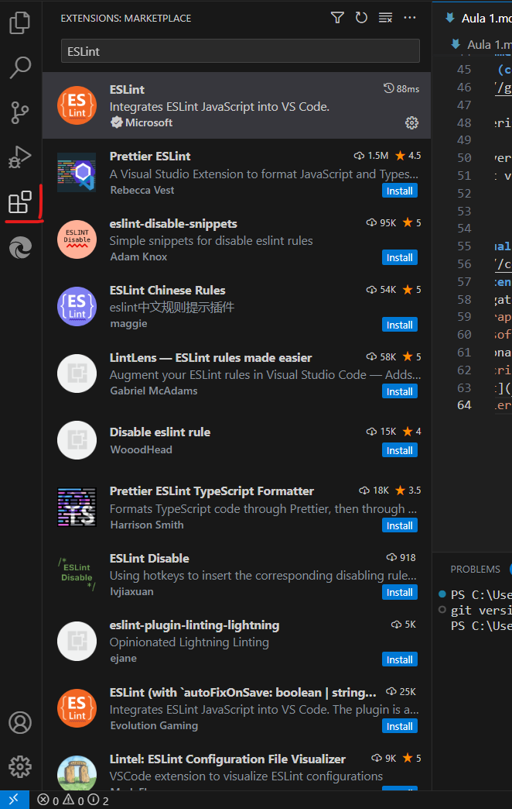
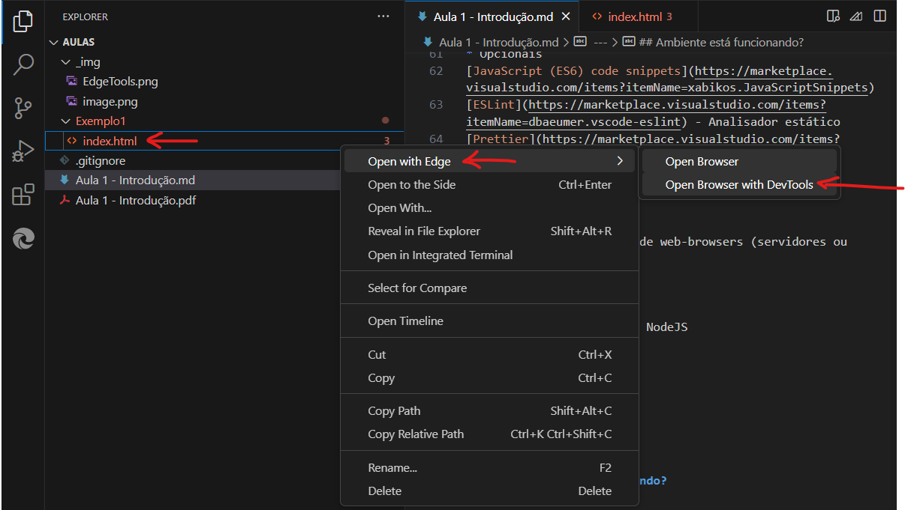
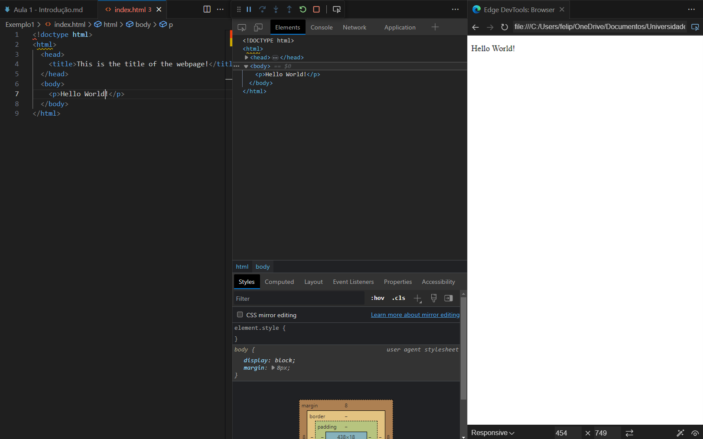
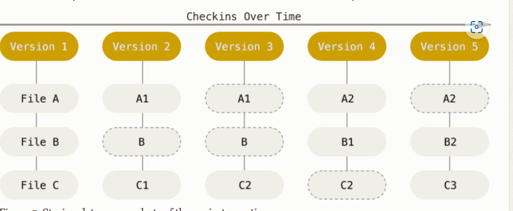
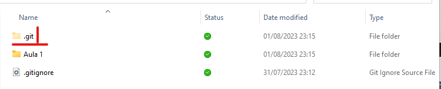
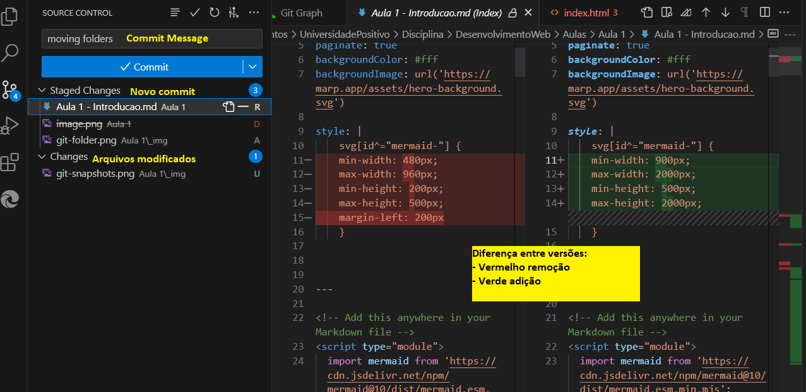
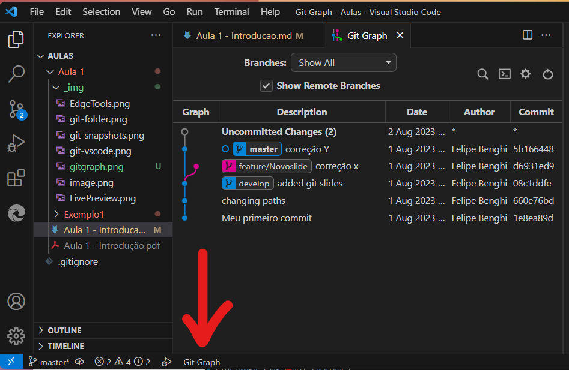

<!-- Markdown is a lightweight markup language that you can use to add formatting elements to plaintext text documents -->
<script type="module">
  import mermaid from 'https://cdn.jsdelivr.net/npm/mermaid@10/dist/mermaid.esm.min.mjs';
  mermaid.initialize({ startOnLoad: true });
</script>

# **Desenvolvimento Web Básico**
Felipe Marx Benghi
fbenghi@gmail.com


---

## Objetivos
[ ] Apresentação do plano de aulas da disciplina (Ementa)
[ ] Bibliografia
[ ] Ferramentas
[ ] Versionamento de Código (Git) e GitHub

---
# HTML 5 and CSS
#### HTML e CSS (primeira parte)
* ROBSON, Elisabeth; FREEMAN, Eric (co-autor). Use a cabeça! HTML e CSS. 

#### Javascript (segunda parte)
* FLANAGAN; DAVID. JavaScript. O guia definitivo

#### Outros links
[**Mozilla**](https://developer.mozilla.org/en-US/docs/Learn/CSS), [Code Academy](https://www.codecademy.com/catalog/language/html-css)

---
# Ferramentas
## GIT (controle de versão)
https://git-scm.com/downloads

Para verificar se está instalado
```
git --version
>>> git version 2.41.0.windows.3
```

---
## Visual Code
https://code.visualstudio.com/
### Extensions
* Necessárias
[Microsoft Edge Tools](https://marketplace.visualstudio.com/items?itemName=ms-edgedevtools.vscode-edge-devtools) ou [Live Server](https://marketplace.visualstudio.com/items?itemName=ritwickdey.LiveServer)
* Opcionais
[Git Graph](https://marketplace.visualstudio.com/items?itemName=mhutchie.git-graph)
[JavaScript (ES6) code snippets](https://marketplace.visualstudio.com/items?itemName=xabikos.JavaScriptSnippets)
[ESLint](https://marketplace.visualstudio.com/items?itemName=dbaeumer.vscode-eslint) - Analisador estático
[Prettier](https://marketplace.visualstudio.com/items?itemName=esbenp.prettier-vscode) - Code formatter
[Marp for VS Code](https://marketplace.visualstudio.com/items?itemName=marp-team.marp-vscode) Cria uma presentação com Markdown

Marp

---

# Markdown
# Título 1
## Título 2
* ddsada
  * dasasd

1. Número 1
1. Numero2

<!-- 
Esse é um comentário
-->

---
## NodeJS
Executar javascript fora de web-browsers (servidores ou desktops)
https://nodejs.org/en


## NPM
Gerenciador de pacotes do NodeJS
```
node --version
>> v18.17.0
npm --version
>> 9.6.7
```

---
## Ambiente está funcionando?


---


<br>

# **Está funcionando!!**

---
# GIT
* Controle de Versão: sistema que registra as mudanças em arquivos através do tempo e que permite recuperar versões antigas. 
* Existem diversos tipos de controle de versão (ex. GIT, TortoiseSVN). Mas GIT é o padrão da indústria.

---
# GIT
## Funcionamento:
  *  Armazena dados (modificações) como um snapshot (fotografia) do projeto/repositório
  * Se um arquivo não sofreu alterações em um commit para o commit anterior, cria-se um link para o "snapshot" antigo
---
## Sequência de "Snapshots" do repositório


---
## Pontos principais para utilizar o GIT:
1. Commit
1. Branches
1. Git on the Server (GitHub)

---
## Inicializar um repositório GIT
```
git init
```
Comando irá criar uma pasta oculta!


---
## Deu tudo certo?
* Algum arquivo modificado em relação ao último commit? Algo deu errado na última operação?
```
git status
```

---
## Commit: cria um snapshot do repositório
* Selecionar os arquivos que farão partes do commit
```sh
git add . // Seleciona todos os arquivos modificados

git add images/logo.png scripts/app.js // Seleciona alguns arquivos
```

* Cria um novo commit (snapshot) com uma mensagem
```
git commit -m "Meu primeiro commit"
```

---
## Listar commits
* Lista de todos os commits
```
git log
```


---
## Branches
* Permite diferentes ramos de desenvolvimento 

<div class="mermaid">
%%{init: { 'logLevel': 'debug', 'theme': 'base', 'gitGraph': {'showBranches': true}} }%%
  gitGraph
    commit id:"1"
    commit id:"2"
    commit id:"3"

</div>


<!--
<div class="mermaid">
%%{init: { 'logLevel': 'debug', 'theme': 'base', 'gitGraph': {'showBranches': true}} }%%
  gitGraph
    commit
    commit
    branch develop
    checkout develop
    commit
    commit
    checkout main
    merge develop
    commit
    commit
</div>
-->

---
# Branches
* Novo Branch
```
  git branch novo_branch
```
* Trocar de branch
```
  git checkout novo_branch
```
* Novo branch + Trocar de branch
```
  git checkout -b novo_branch
```
* Merge unir branches
```
  git checkout -b novo_branch
```
---
## Branches
* Merge unir branches
```
  git merge novo_branch
```
Alguns cuidados para antes do merge:
- Não deixar modificações sem commit
- Estar branch de destino!!! (usar git checkout)

---
## Git no VS CODE


---
#### GIT Graph

--

---
## Git no Servidor (Github)
* Carregar atualizações do servidor, sem atualizar branches locais
```
  git fetch <remote> <branch>
```
* Carregar atualização do servidor e atualizar branches locais
```
  git pull <remote> <branch>
```
* Enviar atualizações do servidor e atualizar branches locais
```
  git push <remote> <branch>
```