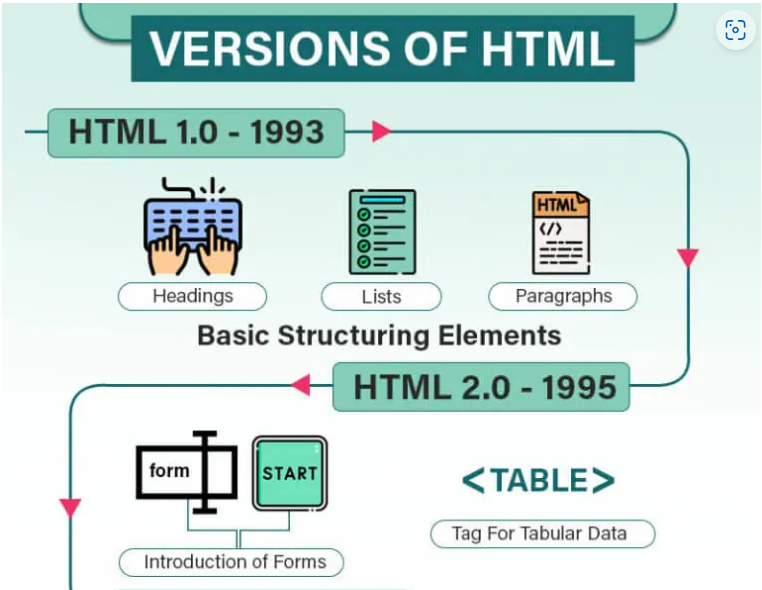
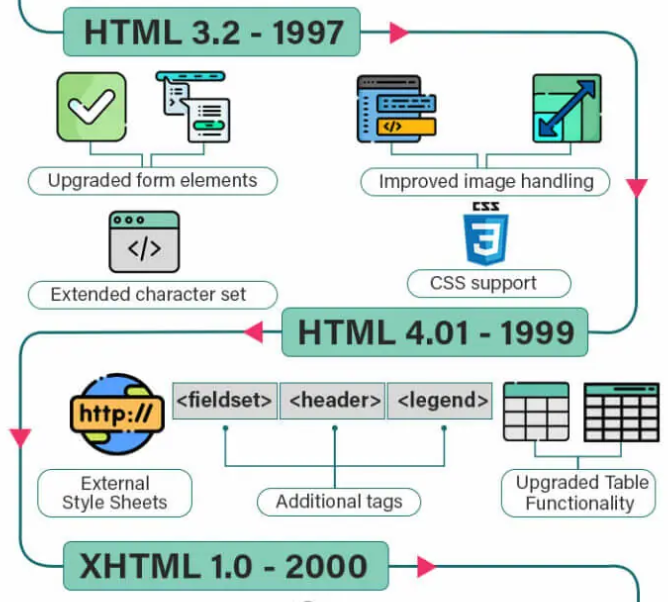
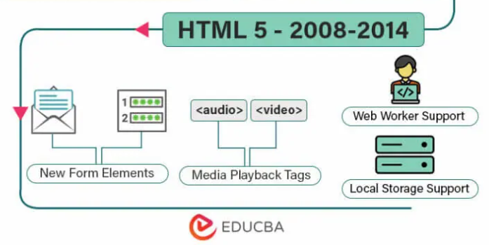

<script type="module">
  import mermaid from 'https://cdn.jsdelivr.net/npm/mermaid@10/dist/mermaid.esm.min.mjs';
  mermaid.initialize({ startOnLoad: true });
</script>

# **Desenvolvimento Web Básico**
## Aula 02 - Introdução a HTML
Prof. Felipe Marx Benghi 
https://github.com/fbenghi/WebBasico2023-2


---

## Objetivos
[ ] História do HTML e versões
[ ] Estrutura do documento HTML
[ ] Atributos 
[ ] Cuidados

---

# Introdução
É a linguagem mais usada para fazer páginas web!

1993 - Primeira versão foi feita por Tim Berners-Lee, que trabalhava na seção de computadores do CERN.

Motivo: Ele queria referenciar (fazer um link) de um artigo científico para outro. 

---
## HTML = Hypertext Markup Language
* Hypertext (hipertexto): texto que contém referência (link) para outros textos
* Markup language (linguagem de marcação): linguagem que descreve a estrutura de um documento adicionando marcações.

Logo:
> HTML = Linguagem que tem uma estrutura descrita por marcações/etiquetas (markups/tags) e conecta documentos por links.

---


---


---



Fonte: [EDUCBA](https://www.educba.com/versions-of-html/)

---

# `<Tags>` (etiquetas/marcações)

---
## `<Tags>` (etiquetas/marcações)
Estrutura fundamental de todo documento HTML
* Formato completo:
```html
<elemento>Conteúdo</elemento>
```
Ex: parágrafo `<p>Olá</p>`

* Se não houver conteúdo:
```html
<elemento /> ou <elemento>
```
Ex: Pular linha: `<br/>`

---
## Regras para `<tags>`
### Alinhamento
1. É permitido adicionar elementos `<tags>` dentro de outros elementos
1. MAS, o elemento interno precisa terminar ANTES do elemento externo

:white_check_mark: Correto:
```html
<elemento1> Começo conteúdo 1 <elemento2> conteúdo 2 </elemento2> fim do conteúdo 1 </elemento1>
```
:x: Incorreto:
```html
<elemento1> Começo conteúdo 1 <elemento2> conteúdo 1 e 2 </elemento1> fim do conteúdo 2 </elemento2>
```


---
# Estrutura de um documento HTML
---
## Tipo do Documento
O "tipo" do documento deve estar presente na primeira linha de um documento
Navegadores utilizam para saber como processar/exibir o conteúdo do documento

Exemplos:

* HTML 5:
```html
<!doctype html>
```

* HTML 4: 
```html
<!DOCTYPE HTML PUBLIC "-//W3C//DTD HTML 4.01 Transitional//EN" "http://www.w3.org/TR/html4/loose.dtd">
```

---

## Estrutura básico da um documento HTML

```html
<!DOCTYPE html> 
<html> 
    <head> 
        
    </head> 
    <body> 
        
    </body> 
</html>
```
`<html>...</html>` - Engloba todos os outros elementos HTML
`<head>...</head>` - Informações sobre o documento (descritor)
`<body>...</body>` - Conteúdo da página web
  
:exclamation::exclamation::exclamation: `<body>...</body>` precisa vir depois da `<body>...</head>`:exclamation::exclamation::exclamation: 

---
# Exercício
## Crie um arquivo (.html) com a estrutura básica para que ele seja compatível com a versão 5.

O que você espera visualizar ao fazer isso?

---
# `<head></head>`
## Informações sobre o documento

---
## `<head></head>`
|Elemento | Descrição|
|-|-|
|script | Código que será executado junto com a página (Javascript/PHP) |
|styles | Define estilos (visuais) (CSS) |
| **title** | Título do documento. Normalmente é exibido nas abas do navegador |


---
# `<head></head>`
## `<title> </title>`
Título do documento
```html
<!DOCTYPE html>
<html>
<head>
    <title>Olá, isso é um título</title>
</head>
<body>
</body>
</html>
```

---
## Elementos internos
|Elemento | Descrição|
|-|-|
|base | Descreve a URL base ou alvo para todos os links na página  |
|links | Especifica um recurso externo ao qual o documento é conectado |
|**meta** | Lista genérica para descrição da página, como palavras chave para busca |


--- 
# `<head></head>`
## `<meta> </meta>`

```html
<head>
  <meta charset="UTF-8"> <!-- Símbolos/caracteres que serão usados (encoding)  -->
  <meta name="description" content="Free Web tutorials"> <!-- Descrição -->
  <meta name="keywords" content="HTML, CSS, JavaScript"> <!-- Palavras chave  -->
  <meta name="author" content="John Doe"> <!-- Autor do documento  -->
</head>

```
* IMPORTANTE: character_set -  especifica a lista de símbolos/caracteres  a serem usados. Recomenda-se usar 'UTF-8', que cobre praticamente todos os caracteres do mundo. 

---
# Exercício
## Adicione um título ao documento HTML e defina:
* Suporte a caracteres que serão usados no documento:
* Autor
* Palavras-chave


---
# `<body> </body>`
## Conteúdo do documento HTML

---

### Títulos `<h1></h1>`/`<h2></h2>`/`<h3></h3>`/`<h4></h4>`/`<h5></h5>`
```html
<h1>Título 1</h1>
<h2>Título 2</h2>
<h3>Título 3</h3>
<h4>Título 4</h4>
<h5>Título 5</h5>
<h6>Título 6</h6>
```
<div style="background: rgb(157, 180, 175);">
    <h1>Título 1</h1>
    <h2>Título 2</h2>
    <h3>Título 3</h3>
    <h4>Título 4</h4>
    <h5>Título 5</h5>
    <h6>Título 6</h6>
</div>


---
## Parágrafo `<p></p>`
```html
<p>
Lorem Ipsum is simply dummy text of the printing and typesetting industry. Lorem 
Ipsum has been the industry's standard dummy text ever since the 1500s.
</p>

```
<div style="background: rgb(157, 180, 175);">
<p>
Lorem Ipsum is simply dummy text of the printing and typesetting industry. Lorem 
Ipsum has been the industry's standard dummy text ever since the 1500s.
</p>
</div>

---
## Imagem ``
### Quando src (fonte) está na web
```html

```
<div style="max-width:505px" >
    
</div>

---
## Imagem ``
### Quando src (fonte) está no PC
```html

```
### Quando o caminho está errado
<div style="max-width:505px" >
    
</div>

---

# Exercício
## Crie um página web para um hobby, com :
* Cabeçalho
* Descrição
* Figura

---

# Atributos

---
Informações adicionais sobre  o elemento HTML ou sobre como ele deve ser exibido

```html
<element atributo1="valor1" atributo="valor2" …> 
    content
</element>
```

ou quando não for necessário um valor:

```html
<element atributo1> 
    content
</element>
```

---
## Mais comuns
| Atributo | Descrição |
|-|-|
| class="text" | Define a classificação do elemento (CSS) |
| dir="ltr\|rtl\|auto" | Direção do texto *ltr* (esquerda para a direita) ou *rtl* (direita para esquerda) ou *auto* (definido pelo navegador) |
| hidden | Esconde o elemento |
| id="text" | Cria um identificador único para o elemento |
| lang="text"| Especifica a linguagem (idioma) |
| style="definition" | Define um estilo ou aparência |
| title="text" | Cria um título para o documento aparece como uma tooltip |

---
### hidden 
Esconde elementos

```html
<p>Olá 1</p>
<p hidden>Olá 2</p>
<p>Olá 3</p>
<p hidden>Olá 4</p>
```
* Exibição:
<div style="background: rgb(157, 180, 175);">
    <p>Olá 1</p>
    <p hidden>Olá 2</p>
    <p>Olá 3</p>
    <p hidden>Olá 4</p>
</div>

---
### dir="ltr|rtl|auto"
Direção do texto *ltr* (left-to-right - esquerda para direita) ou *rtl* (right-to-left - direita para esquerda) ou *auto* (definido pelo navegador)

```html
<p>Olá 1</p>
<p dir="ltr">Olá 2</p>
<p dir="rtl">Olá 3</p>
<p dir="auto">Olá 4</p>
```
* Exibição:
<div style="background: rgb(157, 180, 175);">
<p>Olá 1</p>
<p dir="ltr">Olá 2</p>
<p dir="rtl">Olá 3</p>
<p dir="auto">Olá 4</p>
</div>

---
### lang="text"
Indica o idioma para ferramentas de busca e os navegadores
:exclamation: Obrigatório
* Português: "pt-br"
* Inglês: "en"
* Espanhol: "es"

```html
<!DOCTYPE html>
<html lang="en">
<body>
...
</body>
</html>
```

---
# Cuidados
---
## Espaços em branco (whitespace)

São considerados *Espaços em Branco*:
* Espaço (teclado: espaço)
* Tabulação (teclado: tab)
* Quebra-de-linha (teclado: enter)

Eles recebem tratamento especial!

---
## Múltiplos (+ de 1) *Espaços em Branco* são ignorados

Tab:
```html
<elemento>      Conteúdo        aqui        </elemento>
```
<div style="background: rgb(157, 180, 175);">
Tab: <elemento>      Conteúdo        aqui        </elemento>
</div>

Espaço:
```html
Espaço: <elemento>  Conteúdo        aqui     </elemento>  
```
<div style="background: rgb(157, 180, 175);">
Espaço: <elemento>  Conteúdo        aqui     </elemento>  
</div>

---
## Múltiplos (+ de 1) *Espaços em Branco* são ignorados
Enter:

```html
<p>    
Conteúdo     


aqui
</p>
```

<div style="background: rgb(157, 180, 175);">
<p >    
Conteúdo     


aqui
</p>
</div>


---

#### *Espaços em Branco* no começo e final de elementos são ignorados
```html
<p>Olá</p>
<p>       Olá         </p>
<p>
    Olá
</p>
```
<div style="background: rgb(157, 180, 175);">
<p>Olá</p>
<p>       Olá         </p>
<p>
    Olá
</p>
</div>

---
### `<tags>` não são sensíveis a letras maiúsculas e minúsculas

```html
<p>Olá</p>
<P>Olá</P>
<P>
    Olá
</p>
```
<div style="background: rgb(157, 180, 175);">
<p>Olá</p>
<P>Olá</P>
<P>
    Olá
</p>
</div>

---
# FIM

---
