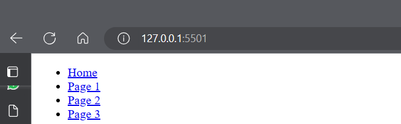
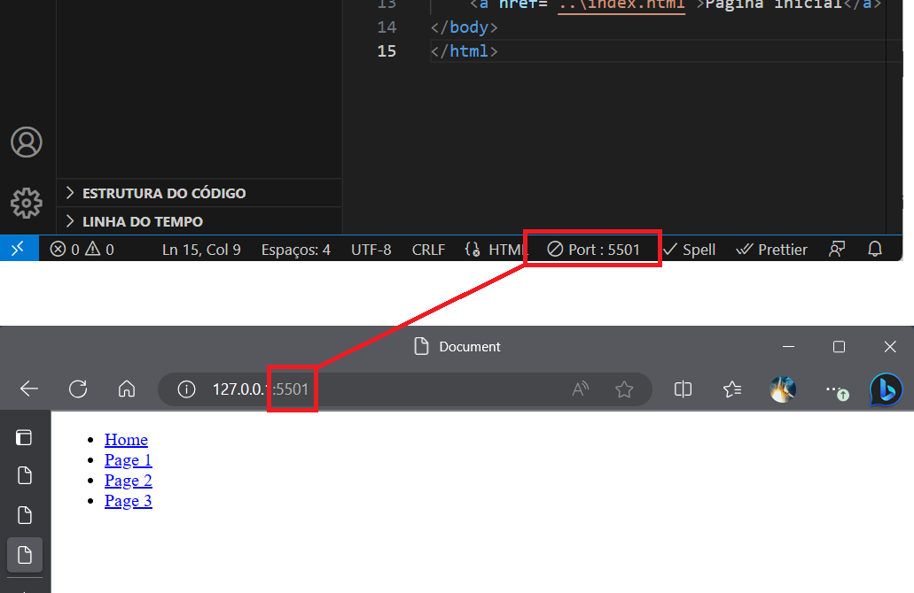
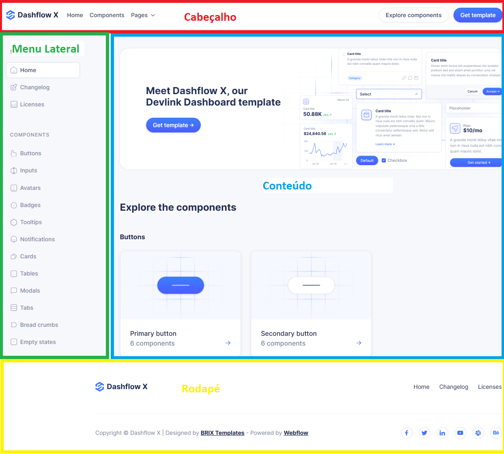
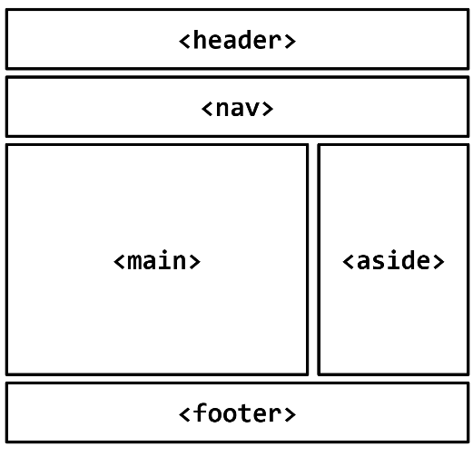
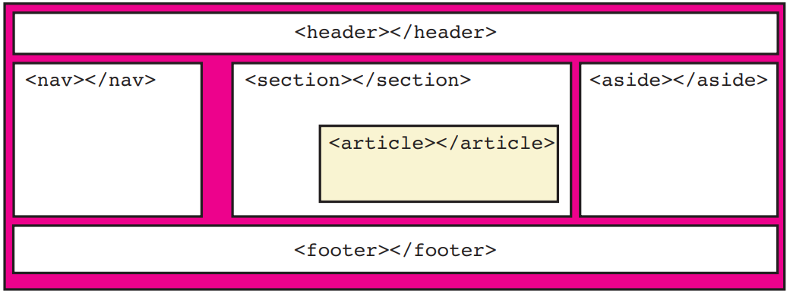
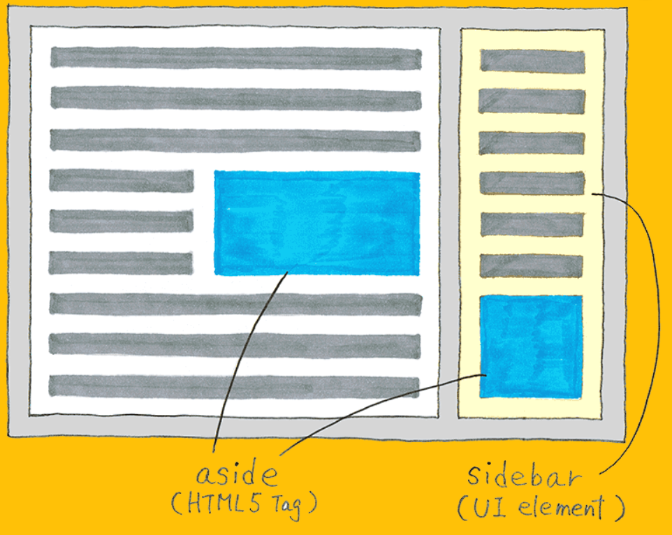
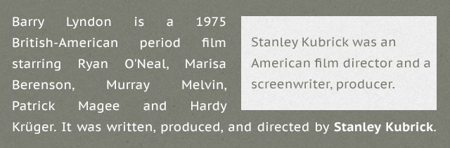

<script type="module">
  import mermaid from 'https://cdn.jsdelivr.net/npm/mermaid@10/dist/mermaid.esm.min.mjs';
  mermaid.initialize({ startOnLoad: true });
</script>

# **Desenvolvimento Web Básico**
## Aula 03 - Elementos de estruturação de páginas HTML 
Prof. Felipe Marx Benghi 
https://github.com/fbenghi/WebBasico2023-2


---

## Objetivos
[ ] Pastas e navegação com hiperlinks  
[ ] Elementos de estruturação de páginas HTML 
[ ] Estruturação de conteúdo (parte 1)

---

# Revisão
1. Crie uma nova página web `sobre.html` que fale sobre os donos/proprietários da página web 
1. Adicione uma foto dos donos/proprietários a essa página, com o nome `donos`

---
# Pastas e navegação com hiperlinks  

1. Reproduza a estrutura de pastas abaixo
    ```
    Projeto
    |
    |--- _img
    |      |--- donos.png/jpg
    |
    |
    |--- html
    |      |--- sobre.html
    |
    |--- index.html
    ```
1. Como navegar pelas páginas html? O que aconteceu com a imagem?

---
## Pastas e navegação com hiperlinks  
Usando hiperlinks (`<a>`):
* Crie um link para uma página externa (exemplo: http://google.com)

* Crie links para navegar entre páginas da sua aplicação.


Exemplo: 
`<a href="http://google.com">Google</a>` <a href="http://google.com">Google</a>
`<a href="caminho-relativo/pagina.html">Pagina</a>`


---
# Pastas e navegação com hiperlinks  

* URL: 127.0.0.1:5501


* Endereço de IP: identificação da máquina na rede
    * Computador que está executando o programa: 127.0.0.1 = http://localhost/
* Porta: software de aplicação específica  servindo de ponto final de comunicações em um sistema operacional hospedeiro de um computador -  5501

---
## Usando o Live Server


---

# Como uma página web abaixo é normalmente organizada?
Por exemplo:
https://dashflowtemplate.webflow.io/

---


--- 
## HTML 5
* `<header>` Cabeçalho da página ou seção
* `<nav>` Links de navegação
* `<main>` Conteúdo principal da página
* `<section>` Seções
* `<article>` Conteúdo da página
* `<aside>` Barra lateral ou conteúdo relacionado ao `<main>`
* `<footer>` Rodapé da página de seção
* `<div>` Define uma divisão de página - antes do HTML5, usava-se `<div>` para [quase] tudo


---



---

## Diretivas gerais:

- Para marcar o *cabeçalho* da página, use o elemento `header`.
- Para marcar *conteúdo independente*, use o elemento `article`.
- Para marcar uma *lista de navegação* de links, use o elemento `nav`.
- Para marcar uma *barra lateral*, use o elemento `aside`.
- Para marcar o *rodapé* da página, use o elemento `footer`.
- Para agrupar *conteúdo geral*, use o elemento `section`.
- Para marcar o *conteúdo principal* de uma página ou seção, use o elemento `main`.

---
# Exercício
## Adicione a sua página:
1. `<main>`
1. `<footer>`

---
## Header

```html
<header>
    <nav>
        <ul>
            <li><a href="#">Home</a></li>
            <li><a href="#">Page 1</a></li>
            <li><a href="#">Page 2</a></li>
            <li><a href="#">Page 3</a></li>
        </ul>
    </nav>
</header>
```

`<ul></ul>` Unordered List - lista não-ordenada 
`<li></li>` List Item - Item de lista

---
# Exercício
1. Adicione links de navegação a página `index.html` no cabeçalho

```html
<header>
    <nav>
        <ul>
            <li><a href="#">Home</a></li>
            <li><a href="#">Page 1</a></li>
            <li><a href="#">Page 2</a></li>
            <li><a href="#">Page 3</a></li>
        </ul>
    </nav>
</header>
```

---
## Aside
> Conteúdo que está tangencialmente relacionado ao conteúdo ao redor do elemento `aside` e que pode ser considerado separado desse conteúdo



---
## Aside
Se usado DENTRO de elementos `<section>` ou `<article>`

```html
<article>
    <p>Barry Lyndon is a 1975 (...) by William Makepeace</p>
    <!-- aside inside article -->
    <aside>
        Stanley Kubrick was an American film director and a  screenwriter, producer.
    </aside>
</article>

```



---
## Aside
Se usado FORA de elementos `<section>` e `<article>`, normalmente é uma barra lateral


```html
<body>
     <h1>Title of the website</h1>
     <article>
        <h1>My last article</h1>
        <p>Ianuas ad muneratam (...) ut poposcerat iam ad</p>
     </article>
     <!-- aside outside article -->
     <aside>
        <h1>My last tweets</h1>
        <ul>
            <li><a href="#">quoque... </a></li>
            <li><a href="#">inleceb... </a></li>
            <li><a href="#">locaaer... </a></li>
        </ul>
      </aside>
</body>
```

---

# Novos elementos html
- Para marcar um parágrafo, use o elemento `p`.
- Para marcar uma citação estendida, use o elemento `blockquote`.
- Para marcar uma caixa de figura, use o elemento `figure`.
- Para marcar uma divisão genérica do conteúdo da página, use o elemento `div`.


---
## Inserir símbolos
Exemplos:
- &nbsp - Espaço em branco
- `&copy;` &copy;
- `&#8226` (b)

Lista:
https://websemantics.uk/articles/html-symbols/


---
## Deixando mais bonito
1. Acesse https://bootswatch.com/
1. Escolha um estilo e baixe o arquivo `bootstrap.css`
1. Crie uma pasta `css` e adicione o arquivo
1. Adicione ao `<head><\head`:
    ```<link rel="stylesheet" href="css/bootstrap.min.css"> ```
1. Defina classes abaixo ao `<head><\head`:
```html
<nav class="navbar navbar-expand-lg fixed-top bg-primary">
    <div class="container-fluid">
        <ul class="navbar-nav">
            <li class="nav-item">
            <a class="nav-link active" aria-current="page" href="#">Home</a>
            </li>
        </ul>
    </div>
</header>
```

---
# FIM

