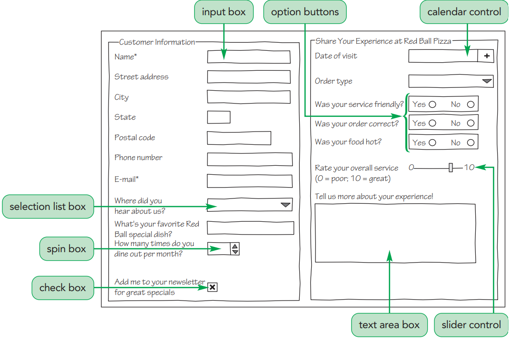
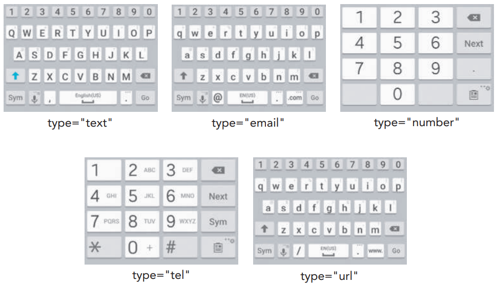

<script type="module">
  import mermaid from 'https://cdn.jsdelivr.net/npm/mermaid@10/dist/mermaid.esm.min.mjs';
  mermaid.initialize({ startOnLoad: true });
</script>

# **Desenvolvimento Web Básico**
## Aula 04 - Elementos  HTML 
Prof. Felipe Marx Benghi 
https://github.com/fbenghi/WebBasico2023-2


---

## Objetivos
[ ] Estruturação de conteúdo (h1, h2, h3, p, textarea, br, ol, ul, li, span, strong, em, img, video, audio)  
[ ] Elementos de formulários (form, inputs, selects, buttons...)

---
# Mídia

---
## Video
* Embarca o vídeo no documento HTML
* Pode conter mais de uma fonte (src). Será exibido a primeira fonte suportada pelo navegador.
* Atributos:
    * controls: indica se o controle de video deve ser exibido
    * autoplay: reprodução automática
    * loop: vídeo recomeça assim que terminar

```html
<video width="320" height="240" controls>
  <source src="Exemplo/221017_02_Urban Football_4k_004_preview.mp4" type="video/mp4">
  <source src="movie.ogg" type="video/ogg">
  Video não suportado pelo navegador
</video>
```


---
## Audio
Mesmo formato do elemento `<video>`

```html
<audio controls>
  <source src="horse.ogg" type="audio/ogg">
  <source src="horse.mp3" type="audio/mpeg">
  Your browser does not support the audio tag.
</audio>
```
---
## Exercício:
Crie uma nova página com um vídeo do seu hobby.
Faça esta página acessível pelo Menu Principal.

Download video: https://www.videvo.net/


---
# Formatação de texto
---
### Títulos `<h1></h1>`/`<h2></h2>`/`<h3></h3>`/`<h4></h4>`/`<h5></h5>`
```html
<h1>Título 1</h1>
<h2>Título 2</h2>
<h3>Título 3</h3>
<h4>Título 4</h4>
<h5>Título 5</h5>
<h6>Título 6</h6>
```
<div style="background: rgb(157, 180, 175);">
    <h1>Título 1</h1>
    <h2>Título 2</h2>
    <h3>Título 3</h3>
    <h4>Título 4</h4>
    <h5>Título 5</h5>
    <h6>Título 6</h6>
</div>


---
## Parágrafo `<p></p>`
```html
<p>
Lorem Ipsum is simply dummy text of the printing and typesetting industry. Lorem 
Ipsum has been the industry's standard dummy text ever since the 1500s.
</p>

```
<div style="background: rgb(157, 180, 175);">
<p>
Lorem Ipsum is simply dummy text of the printing and typesetting industry. Lorem 
Ipsum has been the industry's standard dummy text ever since the 1500s.
</p>
</div>

---
## `<span>`
* Container inline (mantém a mesma linha)
* Parecido com o `<div>`, mas o `<div>` cria um novo bloco e o `<span>` mantém a mesma linha
* Usado para formatar partes específicas do texto

```html
<p>
Esta é a <span style="background:red">disciplina</span> de <div style="background:yellow">Web Básico</div>. OK?
</p>
```

<div style="background: rgb(157, 180, 175);">
<p>
olá, esta é a <span style="background:red">disciplina</span> de <div style="background:yellow">Web Básico</div>. OK?
</p>
</div>

---
## textarea 
Área de texto - pode permitir a inserção de texto pelo usuário
* rows: número de linhas
* cols: número de colunas
* readonly: não permite edição

```html
<textarea rows="4" cols="10" readonly>
"Lorem ipsum dolor sit amet, consectetur adipiscing elit, sed
 do eiusmod tempor incididunt ut labore et dolore magna 
 aliqua. Ut enim ad minim veniam, quis nostrud exercitation 
 ullamco laboris nisi ut aliquip ex ea commodo consequat. Duis 
 aute irure dolor in reprehenderit in voluptate velit esse 
 cillum dolore eu fugiat nulla pariatur. Excepteur sint 
 occaecat cupidatat non proident, sunt in culpa qui officia 
 deserunt mollit anim id est laborum."
 
</textarea>
```

---
## Negrito `<strong>`
```html
<p>
    Cuidado, <strong>Perigo!</strong>
</p>
```
<div style="background: rgb(157, 180, 175);">

<p>
    Cuidado, <strong>Perigo!</strong>
</p>
</div>

## Itálico `<em>`
```html
<p>
    Cuidado, <em>Perigo!</em>
</p>
```
<div style="background: rgb(157, 180, 175);">
<p>
    Cuidado, <em>Perigo!</em>
</p>
</div>


---
## Lista Ordenada `<ol><li>item</li></ol>`
Atributos opcionais:
* reversed: númeração decrescente
* start: primeiro índice (por padrão é 1)
* value: força um valor no índice

```html
<ol reversed start="50"> 
    <li>California</li> 
    <li>Los Angeles</li> 
    <li value="88">Texas</li> 
    <li >New York</li> 
</ol
```
<div style="background: rgb(157, 180, 175);">
<ol reversed start="50"> 
    <li>California</li> 
    <li>Los Angeles</li> 
    <li value="88">Texas</li> 
    <li >New York</li> 
</ol>
</div>

---
## Lista Não-Ordenada `<ul><li>item</li></ul>`

```html
<ul> 
    <li>California</li> 
    <li>Texas</li> 
    <li>New York</li> 
</ul>
```
<div style="background: rgb(157, 180, 175);">
<ul> 
    <li>California</li> 
    <li>Texas</li> 
    <li>New York</li> 
</ul>
</div>

---
### Listas alinhadas (Nested List - Não Ordenadas)

```html
<ul>
    <li>Estados Unidos
        <ul> 
            <li>California</li> 
        </ul>
    </li>
    <li>Brasil
        <ul> 
            <li>Curitiba</li> 
        </ul>
    </li>
</ul>
```
<div style="background: rgb(157, 180, 175);">
<ul>
    <li>Estados Unidos
        <ul> 
            <li>California</li> 
        </ul>
    </li>
    <li>Brasil
        <ul> 
            <li>Curitiba</li> 
        </ul>
    </li>
</ul>
</div>

---
### Listas alinhadas (Nested List - Ordenadas)
```html
<ol>
    <li>Estados Unidos
        <ol> 
            <li>Nova Iorque
                <ol> 
                    <li>Brooklin</li> 
                    <li>Manhatam</li> 
                </ol>
            </li> 
        </ol>
    </li>
    <li>Brasil</li>
</ol>
```

<div style="background: rgb(157, 180, 175);">
<ol>
    <li>Estados Unidos
        <ol> 
            <li>Nova Iorque
                <ol> 
                    <li>Brooklin</li> 
                    <li>Manhatam</li> 
                </ol>
            </li> 
        </ol>
    </li>
    <li>Brasil</li>
</ol>
</div>

---
## Exercício:
Adicione os motivos de você ter selecionado vídeo. 
Crie uma área para que o usuário escreve comentários (`textarea`).

---
# Formulários
---

## Formulários



---

## Formulários `<form>...</form>`

* id: identifica o formulário, para o caso de existir mais de um formulário na página

```html
<form id="pesquisa"> 
    Conteúdo
</form>
```


---
## Entrada de dados `<input>`
`<input name="name" id="id" type="type" />`

* name: nome usado para referenciar os dados quando o formulário for submetido
* id: identificação do elemento
* type: determina o tipo da caixa de entrada. Por exemplo:
<label> Seletor de cores <input name="customColor" id="colorPickerId" type="color"/></label> ou <label> <input name="submitName" id="submitId" type="submit" value="Botão"/></label>
* value: Determina um valor padrão

---

### Label (etiqueta)
<label style="margin-bottom:5px"> 
    Nome da rua
    <input name="custStreet" id="street" />
</label>
<br>

Opção 1)
```html
<label for="id">Nome da rua</label> 
<input name="custStreet" id="street" type="text" />
```
Opção 2)
```html
<label> 
    Nome da rua
    <input name="custStreet" id="street" /> 
</label>
```

---
## Tipos de `<input>` - Textos e números
|Tipo| Descrição |
|-|-|
| number | Selecionar um valor numérico |
| text | Uma caixa de entrada usada para entradas de texto (o padrão) |
| password | Uma caixa de entrada na qual o valor é ocultado por símbolos ** |
| radio | Um botão de opção que pode ser clicado |
| range | Controle deslizante no qual os usuários podem selecionar um valor numérico dentro de um intervalo definido |
| tel | Uma caixa de entrada usada para números de telefone |
| email | Endereços de e-mail |

---
## Tipos de `<input>` - Textos e números
```html
<form id="pesquisa"> 
    <label for="numberId">Número</label>
    <input name="numberName" id="numberId" type="number" min="1" max="5"/>
    <label>Texto: 
        <input name="textName" id="textId" type="text"/>
    </label>
    <label>Senha
        <input name="passwordName" id="passwordId" type="password"/>
    </label>
    <label>Range (intervalo)
        <input name="rangeName" id="rangeId" type="range" min="0" max="50"/>
    </label>
</form>
```
<div style="background: rgb(157, 180, 175);font-size:35px">
<form id="pesquisa"> 
    <label for="numberId">Número</label>
    <input name="numberName" id="numberId" type="number" min="1" max="5"/>
    <br>
    <label>
        Texto: 
        <input name="textName" id="textId" type="text"/>
    </label>
    <br>
    <label>
        Senha
        <input name="passwordName" id="passwordId" type="password"/>
    </label>
    <br>
    <label>
        Range (intervalo)
        <input name="rangeName" id="rangeId" type="range" min="0" max="50"/>
    </label>
</form>
</div>

---
## Diferentes tipos de teclado


---
## Tipos de `<input>` - Botões
|Tipo| Descrição |
|-|-|
| image | Uma imagem que pode ser clicada para executar uma ação |
| reset | Apagar os valores já inseridos no formulário |
| search | Pesquisar um termo definido (funciona como um botão normal) |
| button | Um botão para execução de uma ação |
| submit | IMPORTANTE: Envia o formulário para processamento |


---
## Tipos de `<input>` - Botões
```html
<form id="pesquisa">
    <label>Botão: 
        <input name="buttonName" id="buttonId" type="button" value="Cancelar"/>
    </label>
    <br>
    <label>Reset:
        <input name="textName" id="textId" type="text" placeholder="Placeholder"/>
        <input name="resetName" id="resetId" type="reset" value="Apagar"/>
    </label>
    <br>
    <label> Enviar formulário (submit): 
        <input name="submitName" id="submitId" type="submit" value="Enviar"/>
    </label>
</form>
```

<div style="background: rgb(157, 180, 175);font-size:35px">
<form id="pesquisa">
    <label>
        Botão: 
        <input name="buttonName" id="buttonId" type="button" value="Cancelar"/>
    </label>
    <br>
    <label>
        Reset:
        <input name="textName" id="textId" type="text" placeholder="Placeholder"/>
        <input name="resetName" id="resetId" type="reset" value="Apagar"/>
    </label>
    <br>
    <label>
        Enviar formulário (submit): 
        <input name="submitName" id="submitId" type="submit" value="Enviar"/>
    </label>
</form>
</div>

---
## Tipos de `<input>` - Seleção de data e hora
|Tipo| Descrição |
|-|-|
| month | usuários podem selecionar um mês e ano do calendário |
| week  | Um widget do qual os usuários podem selecionar um valor de semana |
| time |Um widget a partir do qual os usuários podem selecionar um valor de hora |
| date | Seleção de uma data do calendário |
| datetime-local | Seleção de data e hora do calendário |

---
## Tipos de `<input>` - Seleção de data e hora
```html
<form id="pesquisa"> 
    <label>Seleção de mês:
        <input name="monthName" id="monthId" type="month"/>
    </label>
    <br>
    <label>Seleção de  semana
        <input name="weekName" id="weekId" type="week" min="1991-12-31" />
    </label>
    <br>
    <label>Seleção de Data e Hora:
        <input name="dateTimeName" id="dateTimeId" type="datetime-local" max="2000-12-31" />
    </label>
    <br>
    <label>Seleção de Data:
        <input type="date" id="dateId" name="dateName" value="2018-07-22" min="2018-01-01" max="2018-12-31" />
    </label>
</form>
```
<div style="background: rgb(157, 180, 175);font-size:35px">
<form id="pesquisa">
    <label>
    Seleção de mês:
        <input name="monthName" id="monthId" type="month"/>
    </label>
    <br>
    <label>
        Seleção de  semana
        <input name="weekName" id="weekId" type="week" min="1991-12-31" />
    </label>
    <br>
    <label>
        Seleção de Data e Hora:
        <input name="dateTimeName" id="dateTimeId" type="datetime-local" max="2000-12-31" />
    </label>
    <br>
    <label>
        Seleção de Data:
        <input type="date" id="dateId" name="dateName" value="2018-07-22" min="2018-01-01" max="2018-12-31" />
    </label>
</form>
</div>

---
## Tipos de `<input>` - Opções
|Tipo| Descrição |
|-|-|
| radio | Um botão de opção que pode ser clicada |
| checkbox | Um checkbox para respostas sim/não  |

---
## Radio Button 
* Permite-se UMA seleção para os inputs que compartilham o atributo `name`

```html
<form id="pesquisa">
    <input type="radio" id="html" name="fav_language" value="HTML">
    <label for="html">HTML</label><br>
    <input type="radio" id="css" name="fav_language" value="CSS">
    <label for="css">CSS</label><br>
    <input type="radio" id="javascript" name="fav_language" value="JavaScript">
    <label for="javascript">JavaScript</label>
</form>
```
<div style="background: rgb(157, 180, 175);font-size:35px">
<form id="pesquisa">
    <input type="radio" id="html" name="fav_language" value="HTML">
    <label for="html">HTML</label><br>
    <input type="radio" id="css" name="fav_language" value="CSS">
    <label for="css">CSS</label><br>
    <input type="radio" id="javascript" name="fav_language" value="JavaScript">
    <label for="javascript">JavaScript</label>
</form>
</div>

---
## Check-box

```html
<form id="pesquisa">
    <input type="checkbox" id="html" name="html" value="HTML">
    <label for="html">HTML</label><br>
    <input type="checkbox" id="css" name="css" value="CSS">
    <label for="css">CSS</label><br>
    <input type="checkbox" id="javascript" name="javascript" value="JavaScript">
    <label for="javascript">JavaScript</label>
</form>
```
<div style="background: rgb(157, 180, 175);font-size:35px">
<form id="pesquisa">
    <input type="checkbox" id="html" name="html" value="HTML">
    <label for="html">HTML</label><br>
    <input type="checkbox" id="css" name="css" value="CSS">
    <label for="css">CSS</label><br>
    <input type="checkbox" id="javascript" name="javascript" value="JavaScript">
    <label for="javascript">JavaScript</label>
</form>
</div>

---
## Tipos de `<input>` - Outros
|Tipo| Descrição |
|-|-|
| color | Selecionar uma cor |
| file | Selecionar um arquivo local  |
| hidden | Ocultar um elemento do usuário |

---
## Tipos de `<input>` - Outros
```html
<form id="pesquisa"> 
    <label> Seletor de cores
        <input name="customColor" id="colorPickerId" type="color"/>
    </label>
    <label> Arquivos:
        <input name="customFile" id="fileId" type="file"/>
    </label>
</form>
```
<div style="background: rgb(157, 180, 175);font-size:35px">
<form id="pesquisa"> 
    <label>
        Seletor de cores
        <input name="ColorName" id="colorPickerId" type="color"/>
    </label>
    <br>
    <label>
        Arquivos:
        <input name="fileName" id="fileId" type="file"/>
    </label>
</form>
</div>

---
## `<select>`
```html
<label for="cars">Choose a car:</label>
<select name="cars" id="cars" form="carform">
  <option value="gol">Gol</option>
  <option value="passat">Passat</option>
  <option value="marea">Marea Turbo</option>
  <option value="vectra">Vectra</option>
</select>
```
<div style="background: rgb(157, 180, 175);font-size:35px">
<label for="cars">Selecione Carros:</label>
<select name="cars" id="cars" form="carform" style="font-size:15px; width:80px ">
  <option value="gol">Gol</option>
  <option value="passat">Passat</option>
  <option value="marea">Marea Turbo</option>
  <option value="vectra">Vectra</option>
</select>
</div>

---
## Exercício:
Crie uma página de cadastro em que o usuário possa inserir:
* Nome Completo `input type="text"`
* Data de nascimento `input type="date"`
* Comprovante de residência `input type="file"`
* Gênero ou "Como gostaria de ser chamadi" `<select>`
* Dados Bancários (Instituição `input type="text"`, agência`input type="text"`, conta`input type="text"`, dígito verificador `input type="number"`)
* Email `input type="email"`
* Nova Senha `input type="password"`
* Aprove as condições de uso `input type="checkbox"`

---
## `fieldset` e `legend` 

`fieldset` Agrupa dados do formulário
`legend`  Nomeia grupos
<form action="#">
  <fieldset>
    <legend>Dados pessoais</legend>
    <label>Nome <input type="text"/></label>
  </fieldset>
  <fieldset>
    <legend>Dados bancário</legend>
    <label>Agência <input type="text"/></label>
  </fieldset>
</form>

---
## Exercício:
Agrupe os dados do formulário de cadastro em:
* Dados pessoais
* Dados Bancárias
* Acesso (email e senha)

---
## Form - Action e Method

* action: especifica endereço URL para envio dos dados. Exemplo: "/pesquisa" 
* method: especifica como os dados serão enviados ("get|post")
    * Get: variáveis na URL
    * Post: HTTP transação post

```html
<form action="/action_page.php" method="get">
  <label for="fname">Primeiro Nome:</label>
  <input type="text" id="fname" name="fname"><br><br>
  <label for="lname">Sobrenome:</label>
  <input type="text" id="lname" name="lname"><br><br>
  <input type="submit" value="Submit">
</form>
```
---
## Exercício:
Qual a diferença entre `post` e `get` nos formulários?

---
# Tabelas

<table>
  <thead>
    <tr>
      <th colspan="2">O Título da Tabela</th>
    </tr>
  </thead>
  <tbody>
    <tr>
      <td>O corpo da tabela</td>
      <td>Com duas colunas</td>
    </tr>
    <tr>
      <td>E duas</td>
      <td>linhas</td>
    </tr>
  </tbody>
</table>


---
# Elementos html para tabela

```html
<table>	Define a tabela
<th>	Define a célula de cabeçalho
<tr>	Define uma linha 
<td>	Define a célula
<caption>	Defines uma legenda
<colgroup>	Especifica uma formatação para um grupo uma ou mais colunas
<col>	Especifica uma propriedade para cada coluna dentro de um <colgroup> 
<thead>	Agrupa o conteúdo de cabeçalho
<tbody>	Agrupa o conteúdo de corpo `body` da tabela
<tfoot>	Agrupa o conteúdo de rodapé da tabela
```


---
<table>
  <caption>Monthly savings</caption>
  <thead>
    <tr>
      <th>O Título da Tabela</th>
    </tr>
  </thead>
  <tbody>
    <tr>
      <td>O corpo da tabela</td>
      <td>Com duas colunas</td>
    </tr>
    <tr>
      <td>E duas</td>
      <td>linhas</td>
    </tr>
  </tbody>
  <tfoot>
    <tr>
      <td>Total</td>
      <td>100.00</td>
    </tr>
  </tfoot>
</table>

---

```html
<table>
  <caption>Monthly savings</caption>
  <thead>
    <tr> <th>O Título da Tabela</th></tr>
  </thead>
  <tbody>
    <tr> <td>O corpo da tabela</td> <td>Com duas colunas</td> </tr>
    <tr> <td>E duas</td>  <td>linhas</td>   </tr>
  </tbody>
  <tfoot>
    <tr><td>Total</td><td>100.00</td> </tr>
  </tfoot>
</table>
```
---

## Colgroup / col
`<colgroup>`	Especifica uma formatação para um grupo uma ou mais colunas
`<col>`	Especifica propriedades para colunas dentro de um `<colgroup>` 

```
<table>
  <colgroup>
    <col span="2" style="background-color:red">
    <col style="background-color:yellow">
  </colgroup>
  <tr>
    <th>ISBN</th>
    <th>Title</th>
    <th>Price</th>
  </tr>
  <tr>
    <td>3476896</td>
    <td>My first HTML</td>
    <td>$53</td>
  </tr>
</table>
```

---
## `<td>`
Célula da tabela

Atributos:
* colspan: por quantas colunas uma célula se expande
* rowspan: por quantas linhas uma célula se expande
---

```html
<table>
  <thead>
    <tr> <th colspan=2>O Título da Tabela</th></tr>
  </thead>
  <tbody>
    <tr> <td>O corpo da tabela</td> <td>Com duas colunas</td> </tr>
    <tr> <td>E duas</td>  <td >linhas</td>   </tr>
  </tbody>
</table>
```


<table>
  <thead>
    <tr> <th colspan=2>O Título da Tabela</th></tr>
  </thead>
  <tbody>
    <tr> <td>O corpo da tabela</td> <td>Com duas colunas</td> </tr>
    <tr> <td>E duas</td>  <td rowspan=2>linhas</td>   </tr>
    <tr> <td>E três</td>     </tr>
  </tbody>
</table>


---

# FIM

