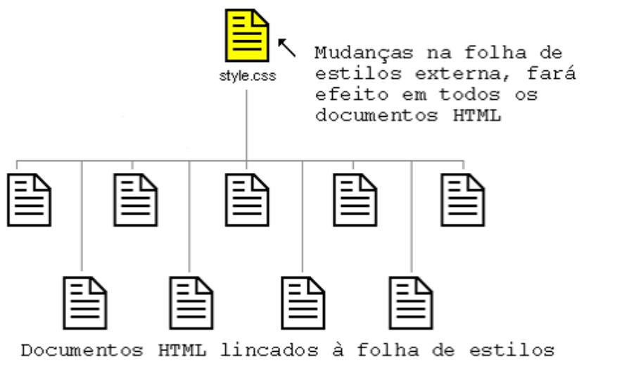
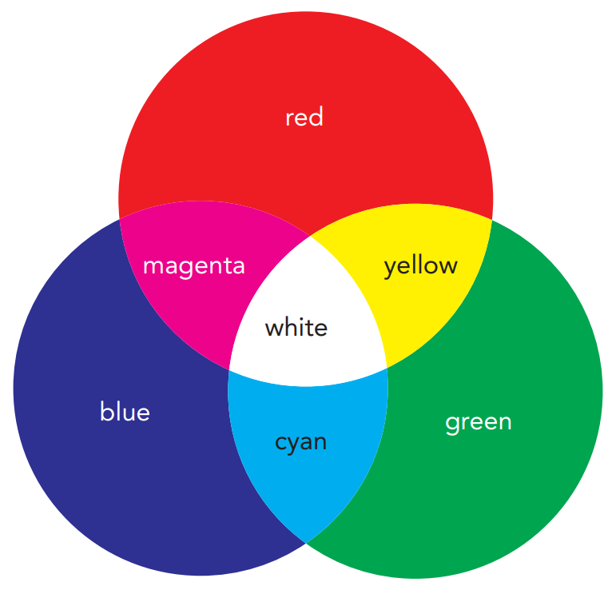

<script type="module">
  import mermaid from 'https://cdn.jsdelivr.net/npm/mermaid@10/dist/mermaid.esm.min.mjs';
  mermaid.initialize({ startOnLoad: true });
</script>

# **Desenvolvimento Web Básico**
## Aula 05 - Introdução ao CSS
Prof. Felipe Marx Benghi 
https://github.com/fbenghi/WebBasico2023-2


---

## Objetivos
[ ] Tipos de estilo
[ ] Regras de estilo
[ ] Formatação usando atributos
[ ] Elementos básicos do CSS

---
# CSS
* O HTML apenas define o conteúdo e a estrutura de um documento, não como ele deve ser exibido. A aparência da página é determinada com Cascading Style Sheets (CSS).
* A versão mais atual do CSS é 3
* CSS = Cascading Style Sheets = Folhas de estilo em Cascata = agregando os estilos

---

## Tipos de estilo
* **Estilo do Navegador** (*browser styles*): primeiros estilos a serem processados na renderização de um site. Na ausência de estilos concorrentes de outras folhas de estilo, os estilos do navegador são aqueles aplicados à página da web

  Onde vimos: rodapé (fonte itálica), títulos (h1, h2, ...), hiperlink (`<a>`)

* **Estilos do usuário** (*user-defined styles*): criados pelo usuário dentro do navegador. Por exemplo, um usuário com deficiência visual poderia tornar um website mais fácil ler alterando as configurações padrão do navegador, exibindo texto em alto contraste cores e uma fonte grande

---
## Tipos de estilo
* **Estilos externos** (*external styles*): criados e colocados em um arquivo CSS e vinculados ao site.
  ``` 
  <link rel="stylesheet" href="css/bootstrap.min.css">
  ``` 

  Onde vimos: quando adicionamos o bootstrap a página web. 

* **Estilos Incorporados** (*embedded styles*): que são os estilos colocados no próprio arquivo HTML

  ```html
  <style> 
    h1 { color: red;  } 
  </style>

  ```
--- 
## Tipos de estilo

* **Estilos Inline** (*inline styles*):  definidos como atributos de elementos HTML. O uso de estilos incorporados e estilos inline não são considerados práticas recomendadas porque violam um dos princípios básicos de HTML: que os arquivos HTML devem descrever apenas o conteúdo e a estrutura do documento e não o design em si.
```html
<element style="property1: value1;property2: value2; …"> 
 content 
</element>
```
Exemplo:
```html
<col span="2" style="background-color:red;color:black">
```
---
# Exercício
Copie a página de exemplo (index.html) e crie estilos em linha.

---
## Regras de estilo
Estilos normalmente tem o seguinte formato:

```html
selector { 
 property1: value1; 
 property2: value2; 
 ... 
}
```

Exemplos:
```html
h1 { 
 color: red; 
 text-align: center; 
}

h1, h2 { 
 color: red; 
}
```

---

## Estilos Incorporados (*embedded styles**)
```html
<style> 
  style rules 
</style>
```

Exemplo:
```html
<style> 
  h1 
  { 
    color: red; 
    text-align: center; 
  } 
</style>
```
---
# Exercício
Modifique os estilos em linha para estilos incorporados (**embedded styles**)

---
## Folha de estilos externas (*external styles*)

```html
<head>
  <link rel="stylesheet" href="css/style.css"/>
</head>
```


---
## Folha de estilos externas
* Definição de encoding [boa prática]
  @charset "utf-8

* Comentários [opcional]
/* 
Descrição 
Autor: 
*/

* Importar folha de estilo [se necessário]
  @import url(sales.css)

---
# Exercício
Modifique os estilos em linha para estilos externos (*external styles*)

---
# Aplicando estilo usando atributos
Até agora, quando criamos um estilo, aplicamos a todos os elementos HTML de um tipo em uma página.

---
## Pelo atributo *id*
Para aplicar um estilo a um elemento com base no id, há duas opções:
* `#id` ou `elem#id`

Exemplo:

```html
<style>
  #meu-id {
    text-align: center;
    color: red;
  }
</style>
<p id="meu-id">Parágrafo com o estilo baseado no ID</p>
<p>Parágrafo não afetado pelo estilo</p>
```

<div style="background: rgb(157, 180, 175);font-size:35px">
  <style>
    #meu-id {
      text-align: center;
      color: red;
    }
  </style>
  <p id="meu-id">Parágrafo com o estilo baseado no ID</p>
  <p>Parágrafo não afetado pelo estilo</p>
</div>

---
## Pelo atributo *class*
```html
  <style>
    .center {
      text-align: center;
      color: red;
    }
  </style>
  <p class="center">Parágrafo com o estilo center</p>
  <p>Parágrafo não afetado pelo estilo</p>
  <p class="center">Mais um parágrafo com o estilo center</p>
```
<div style="background: rgb(157, 180, 175);font-size:35px">
  <style>
    .center {
      text-align: center;
      color: red;
    }
  </style>
  <p class="center">Parágrafo com o estilo center</p>
  <p>Parágrafo não afetado pelo estilo</p>
  <p class="center">Mais um parágrafo com o estilo center</p>
</div>

---
## Resumo
* Aplica em todos os elementos h1
  h1 {...}
* aplica em qualquer elemento com a classe
  .minha-classe {...}
* aplica em todos os elementos especificados
  h1, h2, h3 {...}
* aplica nos elementos `<p>` com a classe especificada
  p.minha-classe {...}
* aplica no id especificado
  #id {...}
* aplica no elemento html com o id especificado 
  elem#id {...}

---
# Exercício
Formate o estilo da página usando ao menos uma "classe " e ao menos um "id"

---
# Regras de Precedência

---
## Regras de Precedência
Quanto mais específico uma regra de estilo, maior sua precedência frente a uma regra mais genérica.
Exemplo: 
* uma regra aplicada a um parágrafo tem maior precedência do que uma regra aplicada para uma página inteira. 
* uma regra aplicada a uma parte do texto tem maior precedência sobre o texto

---
## Regras de Precedência
Estilos carregados por último tem precedência sobre estilos carregados antes
```html
<link href="tss_styles.css" rel="stylesheet" /> 
<style> 
  <!-- Maior precedêcia do que o tss_styles.css!!! -->
  style rules 
</style>
```

--- 
## Atributo !important

* A palavra-chave !important é usada quando o designer precisa substituir seus próprios estilos.

* Em geral, os designers não devem usar o !important palavra-chave porque interfere na ordem em cascata incorporada na linguagem CSS.

```html
<style>
  .vermelho {color:red}
  .azul {color:blue}
</style>
<div class="azul vermelho">
  O texto vai aparecer com o estilo indicado pelo !important
</div>
```
<div style="background: rgb(157, 180, 175);font-size:35px">
  <style>
    .vermelho {color:red!important}
    .azul {color:blue}
  </style>
  <div class="azul vermelho">
    O texto vai aparecer com o estilo indicado pelo !important
  </div>
</div>


---
# Usando CSS
---
## Suporte a cores 
### Cores com nome padrão
CSS suporta 147 nomes de cores. 
Por exemplo: red, green, and yellow to ivory, orange, crimson, khaki, brown


```html
<div style="background: red">Cor 1</div>
<div style="background: khaki">Cor 2</div>
<div style="background: ivory">Cor 3</div>
```

<div style="background: rgb(157, 180, 175);font-size:35px">
  <div style="background: red">
    Cor 1
  </div>
  <div style="background: khaki">
    Cor 2
  </div>
  <div style="background: ivory">
    Cor 3
  </div>
</div>


---
## Suporte a cores 
### RGB
Os valores de cores RGB são baseados na teoria clássica das cores. Todas as cores são determinado pela adição de três cores primárias – vermelho, verde e azul – em diferentes níveis de intensidade.
Formato: rgb(red, green, blue)
<div style="background: rgb(157, 180, 175);font-size:35px">
Seletor de cores: <input type="color">
</div>




---
# Família de Fontes

Contém vários nomes de fontes como um sistema "substituto", para garantir a máxima compatibilidade entre navegadores/sistemas operacionais. 
Comece com a fonte desejada e termine com uma família genérica (para permitir que o navegador escolha uma fonte semelhante na família genérica, se nenhuma outra fonte estiver disponível). Os nomes das fontes devem ser separados por vírgula. 

```html
.p1 {
  font-family: "Times New Roman", Times, serif;
}
```

---
## Tamanho de fonte
* px
```html
html {font-size: 16px;} 
```

* em
1em é igual ao tamanho da fonte atual. O tamanho do texto padrão nos navegadores é 16px. Portanto, o tamanho padrão de 1em é 16px. O tamanho pode ser calculado de pixels para em usando esta fórmula: pixels/16=em
```htm
article {font-size: 0.75em;} 
``````
* Palavra chave
xx-small, x-small, small, medium, large, x-large, xx-large, larger, or smaller
```html
aside {font-size: small;} 
```
---
# Relembrando
## `<span>`
* Container inline (mantém a mesma linha)
* Parecido com o `<div>`, mas o `<div>` cria um novo bloco e o `<span>` mantém a mesma linha
* Usado para formatar partes específicas do texto

```html
<p>
Esta é a <span style="background:red">disciplina</span> de <div style="background:yellow">Web Básico</div>. OK?
</p>
```

<div style="background: rgb(157, 180, 175);">
<p>
olá, esta é a <span style="background:red">disciplina</span> de <div style="background:yellow">Web Básico</div>. OK?
</p>
</div>

---
# Display
* inline: exibe um elemento como um elemento embutido (como `<span>`). Propriedades de altura e largura não terão efeito
* block: exibe um elemento como um elemento de bloco (como `<p>` ou `<div>`). Começa em uma nova linha e ocupa toda a largura
* inline-block: exibe um elemento como um contêiner de bloco em linha. O elemento em si é formatado como um elemento embutido, mas você pode aplicar valores de altura e largura


---
<div style="background: rgb(157, 180, 175);font-size:35px">
  <style>
    .linha {display:inline; width:200px}
    .linha-block {display:inline-block; width:200px}
    .bloco {display:block; width:200px}
  </style>
  Em Linha:<br>
  <div style="background: red;" class="linha">Cor 1</div>
  <div style="background: khaki;" class="linha">Cor 2</div>
  <div style="background: gray" class="linha">Cor 3</div>

  Em Linha-bloco:<br>
  <div style="background: red;" class="linha-block">Cor 1</div>
  <div style="background: khaki;" class="linha-block">Cor 2</div>
  <div style="background: gray" class="linha-block">Cor 3</div>
  
  Em bloco:
  <div style="background: red;" class="bloco">Cor 1</div>
  <div style="background: khaki;" class="bloco">Cor 2</div>
  <div style="background: gray" class="bloco">Cor 3</div>
</div>

---

```html
<div style="background: rgb(157, 180, 175);font-size:35px">
  <style>
    .linha {display:inline; width:200px}
    .linha-block {display:inline-block; width:200px}
    .bloco {display:block; width:200px}
  </style>
  Em Linha:<br>
  <div style="background: red;" class="linha">Cor 1</div>
  <div style="background: khaki;" class="linha">Cor 2</div>
  <div style="background: gray" class="linha">Cor 3</div>

  Em Linha-bloco:<br>
  <div style="background: red;" class="linha-block">Cor 1</div>
  <div style="background: khaki;" class="linha-block">Cor 2</div>
  <div style="background: gray" class="linha-block">Cor 3</div>
  
  Em bloco:
  <div style="background: red;" class="bloco">Cor 1</div>
  <div style="background: khaki;" class="bloco">Cor 2</div>
  <div style="background: gray" class="bloco">Cor 3</div>
</div>
```
---
## Largura e altura
* Para definir a largura (width) e a altura (height) de um elemento:
  * width: valor;
  * height: valor;
* Para definir a largura ou altura mínima possível:
  * min-width: valor;
  * min-height: valor;
* Para definir a largura ou altura máxima possível:
  * max-width: valor;
  * max-height: valor;

---
```html
<div style="background: rgb(157, 180, 175);font-size:35px">
  <style>
    .linha-block {display:inline-block}
  </style>
  <div style="background: red; width:200px" class="linha-block">1- Um texto muito grande</div>
  <div style="background: khaki;max-width:350px" class="linha-block">2 - Um texto muito grande</div>
  <div style="background: gray; min-width:300px"  class="linha-block">3- Um texto muito grande</div>
</div>
```
<div style="background: rgb(157, 180, 175);font-size:35px">
  <style>
    .linha-block {display:inline-block}
  </style>
  <div style="background: red; width:200px" class="linha-block">1- Um texto muito grande</div>
  <div style="background: khaki;max-width:350px" class="linha-block">2 - Um texto muito grande</div>
  <div style="background: gray; min-width:300px"  class="linha-block">3- Um texto muito grande</div>
</div>


---
## Unidades de medida

O valor é a largura ou altura em uma das unidades de medida CSS (px) ou um porcentagem da largura ou altura do elemento pai.
Percentual do elemento pai:
* width: 95%;

Viewports:
* 1vw = 1% da largura da janela do navegador
* 1vh = 1% da altura da janela do navegador
* 1vmin = 1vw ou 1vh (o que for menor)
* 1vmax = 1vw ou 1vh (o que for maior

---
# Exercício
Reorganize a página para que exista uma coluna principal (maior e centralizada) e colunas secundárias na lateral.


---
## Alinhamento de texto
* Alinhamento horizontal
  * text-align: left|right|center|justify; (*esquerda|direita|centralizado|justificado*)

---
# Exercício:
Alinhe horizontalmente:
* Títulos centralizados 
* Coluna do centro justificado, 
* Coluna da direita a esquerda
* Coluna da esquerda a direita


---
<!-- _class: small-font -->

## Margins (margin), Borda (border), Preenchimento (padding)

* *Padding*: espaço que se estende do conteúdo do elemento até a borda do elemento
* a borda (*border*) marca a extensão do elemento
* espaço de margem (*margin*) o espaço composto pelo espaço entre o elemento e o próximo elemento


---

<div style="background: rgb(157, 180, 175);font-size:25px">
  
  <div style="background:red; padding:30px;">
    Lorem ipsum dolor sit amet, consectetur adipiscing elit, sed do eiusmod tempor incididunt ut labore.
  </div>

  <div style="background:blue; margin:30px;">
    Lorem ipsum dolor sit amet, consectetur adipiscing elit, sed do eiusmod tempor incididunt ut labore.
  </div>

  <div style="background:green; border: 20px solid black;padding:30px; margin:30px;">
    Lorem ipsum dolor sit amet, consectetur adipiscing elit, sed do eiusmod tempor incididunt ut labore.
  </div>
</div>

```html
<div style="background:red; padding:30px;">
  Lorem ipsum dolor sit amet, consectetur adipiscing elit, sed do eiusmod tempor incididunt ut labore.
</div>
<div style="background:blue; margin:30px;">
  Lorem ipsum dolor sit amet, consectetur adipiscing elit, sed do eiusmod tempor incididunt ut labore.
</div>
<div style="background:green; border: 20px solid black;padding:30px; margin:30px;">
  Lorem ipsum dolor sit amet, consectetur adipiscing elit, sed do eiusmod tempor incididunt ut labore.
</div>
```

---
## Margins (margin), Borda (border), Preenchimento (padding)
* Todas as bordas
  * margin|padding: size;
    Ex. margin: 5px;

* Configuração por posição
  * margin|padding: top right bottom left;
    Ex. padding: 5px 2px 0px 30px;
  * margin|padding-top: size; 
  * margin|padding-right: size; 
  * margin|padding-bottom: size; 
  * margin|padding-left: size;
    Ex. margin-left: 30px;

---
## Folha de Reset de Estilos (Reset Style Sheet)
* O navegador aplica seus próprios estilos aos elementos HTML da página.
* Muitos designers preferem trabalhar com uma "lousa em branco" e não ter nenhuma regra de estilo do navegador chegando ao final
design de seu site. 
* Isso pode ser feito com uma folha de estilos de redefinição:

https://meyerweb.com/eric/tools/css/reset/
https://meyerweb.com/eric/tools/css/reset/reset.css


---
# FIM

