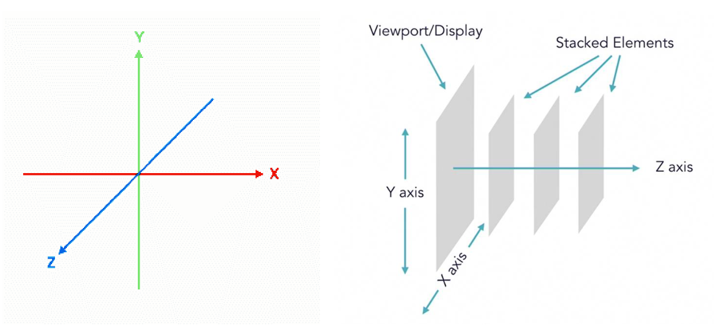
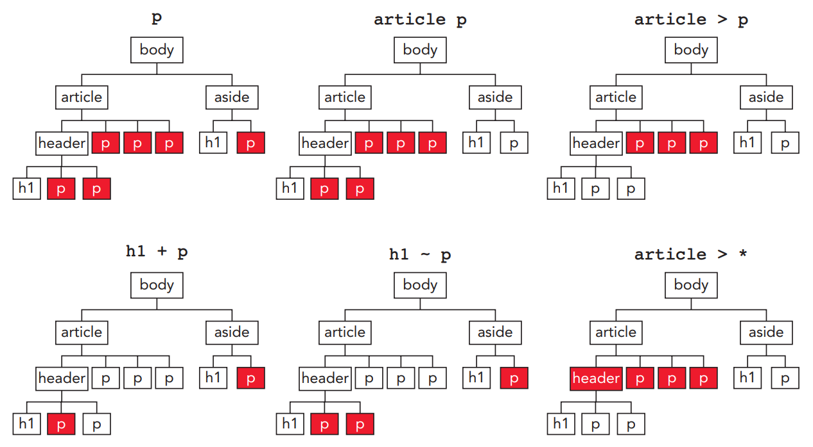
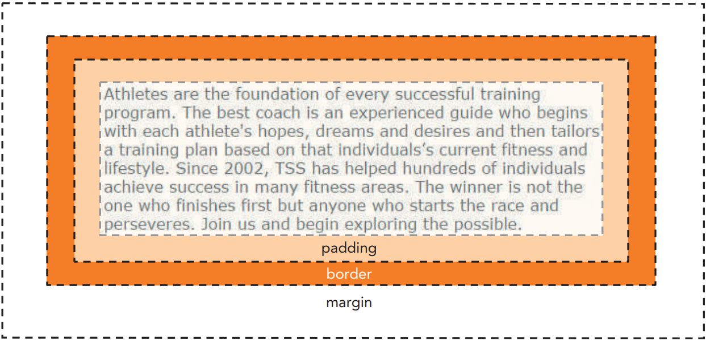

<script type="module">
  import mermaid from 'https://cdn.jsdelivr.net/npm/mermaid@10/dist/mermaid.esm.min.mjs';
  mermaid.initialize({ startOnLoad: true });
</script>

# **Desenvolvimento Web Básico**
## Aula 06 - Introdução ao CSS
Prof. Felipe Marx Benghi 
https://github.com/fbenghi/WebBasico2023-2


---

## Objetivos
[ ] Diferentes formas de posicionamento (display, float, position)
[ ] Regras de estilo
[ ] Formatação usando atributos
[ ] Elementos básicos do CSS

---
# Display
* inline: exibe um elemento como um elemento embutido (como `<span>`). Propriedades de altura e largura não terão efeito
* block: exibe um elemento como um elemento de bloco (como `<p>` ou `<div>`). Começa em uma nova linha e ocupa toda a largura
* inline-block: exibe um elemento como um contêiner de bloco em linha. O elemento em si é formatado como um elemento embutido, mas você pode aplicar valores de altura e largura


---
<div style="background: rgb(157, 180, 175);font-size:35px">
  <style>
    .linha {display:inline; width:200px}
    .linha-block {display:inline-block; width:200px}
    .bloco {display:block; width:200px}
  </style>
  Em Linha:<br>
  <div style="background: red;" class="linha">Cor 1</div>
  <div style="background: khaki;" class="linha">Cor 2</div>
  <div style="background: gray" class="linha">Cor 3</div>

  Em Linha-bloco:<br>
  <div style="background: red;" class="linha-block">Cor 1</div>
  <div style="background: khaki;" class="linha-block">Cor 2</div>
  <div style="background: gray" class="linha-block">Cor 3</div>
  
  Em bloco:
  <div style="background: red;" class="bloco">Cor 1</div>
  <div style="background: khaki;" class="bloco">Cor 2</div>
  <div style="background: gray" class="bloco">Cor 3</div>
</div>

---

```html
<div style="background: rgb(157, 180, 175);font-size:35px">
  <style>
    .linha {display:inline; width:200px}
    .linha-block {display:inline-block; width:200px}
    .bloco {display:block; width:200px}
  </style>
  Em Linha:<br>
  <div style="background: red;" class="linha">Cor 1</div>
  <div style="background: khaki;" class="linha">Cor 2</div>
  <div style="background: gray" class="linha">Cor 3</div>

  Em Linha-bloco:<br>
  <div style="background: red;" class="linha-block">Cor 1</div>
  <div style="background: khaki;" class="linha-block">Cor 2</div>
  <div style="background: gray" class="linha-block">Cor 3</div>
  
  Em bloco:
  <div style="background: red;" class="bloco">Cor 1</div>
  <div style="background: khaki;" class="bloco">Cor 2</div>
  <div style="background: gray" class="bloco">Cor 3</div>
</div>
```
---
## Largura e altura
* Para definir a largura (width) e a altura (height) de um elemento:
  * width: valor;
  * height: valor;
* Para definir a largura ou altura mínima possível:
  * min-width: valor;
  * min-height: valor;
* Para definir a largura ou altura máxima possível:
  * max-width: valor;
  * max-height: valor;

---
```html
<div style="background: rgb(157, 180, 175);font-size:35px">
  <style>
    .linha-block {display:inline-block}
  </style>
  <div style="background: red; width:200px" class="linha-block">1- Um texto muito grande</div>
  <div style="background: khaki;max-width:350px" class="linha-block">2 - Um texto muito grande</div>
  <div style="background: gray; min-width:300px"  class="linha-block">3- Um texto muito grande</div>
</div>
```
<div style="background: rgb(157, 180, 175);font-size:35px">
  <style>
    .linha-block {display:inline-block}
  </style>
  <div style="background: red; width:200px" class="linha-block">1- Um texto muito grande</div>
  <div style="background: khaki;max-width:350px" class="linha-block">2 - Um texto muito grande</div>
  <div style="background: gray; min-width:300px"  class="linha-block">3- Um texto muito grande</div>
</div>


---
## Unidades de medida

O valor é a largura ou altura em uma das unidades de medida CSS (px) ou um porcentagem da largura ou altura do elemento pai.
Percentual do elemento pai:
* width: 95%;

Viewports:
* 1vw = 1% da largura da janela do navegador
* 1vh = 1% da altura da janela do navegador
* 1vmin = 1vw ou 1vh (o que for menor)
* 1vmax = 1vw ou 1vh (o que for maior

---
# Exercício
Reorganize a página para que exista uma coluna principal (maior e centralizada) e colunas secundárias na lateral.


---
# Posicionamento

---
# Float (flutuante)
* Utilizado para substituir o layout baseado em tabelas, mas não é recomendado para isso. **Só deve ser utilizado em casos específicos;**
* Altera o comportamento de um elemento e dos elementos de nível de bloco que estejam no fluxo normal. 
* O elemento é movido para a esquerda ou para a direita e removido do fluxo normal, e o conteúdo flutua ao redor do elemento;

Aceita os valores:
* float: left;
* float: right;
* float: none;
* float: inherit;

---
# Demonstração: float.html

---
# Position
Permite colocar os elementos em posições específicas da página. *Só deve ser usado em casos específicos.* Aceita os valores:
* position: static;
* position: relative;
* position: absolute;
* position: fixed;
* position: sticky;

---
# Demonstração: position.html

---
# Position
Notas:
* `static` e `relative` mantêm o elemento no fluxo normal da página
* `absolute`, `fixed` e `sticky` movem o elemento para outra camada de visualização no eixo-z retirando-o do fluxo normal da página;

---
# Position


---
# Exercícios:
1. Adicione uma imagem como float a uma das colunas
1. Faça os títulos ficarem grudados ao topo da página em caso de rolagem vertical

---
# Seletor de contexto

---
## Seletor de contexto
A seguinte regra de estilo corresponde aplica-se a todo elemento h1 no documento HTML:

```CSS
h1 { 
 color: red; 
}
```

Problemas:
* Normalmente queremos aplicar estilos a elementos em locais específicos.
* Utilizar classes/ids em todos os elementos HTML é trabalhoso (precisam ser adicionados a todos elementos HTML)

Alternativa: seletores de contexto

---
## Seletor de contexto

```CSS
pai descendente { estilo }
```
Estilos são aplicados ao descendente. MAS o descendente não precisa ser um filho direto

```CSS
header h1 { 
 color: red; 
}
```
```HTML
<header> 
 <div> 
 <h1>Tri and Succeed Sports</h1> 
 </div> 
</header>
```
---
|Seletor             | Aplica-se |
|-|-|
| *                  | A qualquer elemento |
| elem               | Ao `elem` localizado em qualquer lugar do documento |
| elem1, elem2, …    | A qualquer um dos elementos `elem1`, `elem2`, etc.|
| pai filho          | A `filho` que descende do elemento `pai` em algum nível|
| pai > filho        | A `filho` que é descendente direto do `pai`|
| elem1 + elem2      | Ao `elem2` que é imediatamente precedido pelo elemento irmão `elem1` |
| elem1 ~ elem2      | Ao `elem2` que segue o elemento irmão `elem1`|

---


---
# Exemplo

```HTML
<style>
.nav {
  background-color: yellow;
}

.nav li {
  display: inline-block;
  font-size: 20px;
  padding: 20px;
}
</style>

<ul class="nav">
  <li><a href="#home">Home</a></li>
  <li><a href="#about">About Us</a></li>
</ul>
```


<style>
.nav {
  background-color: yellow;
}

.nav li {
  display: inline-block;
  font-size: 20px;
  padding: 20px;
}
</style>

<ul class="nav">
  <li><a href="#home">Home</a></li>
  <li><a href="#about">About Us</a></li>
</ul>

---
# Exercício
## Preparação
* Renomeie as colunas da direita para `section`, do centro para `main`, esquerda para `aside`. 
* Adicione ao menos 2 parágrafos a cada coluna
* Crie uma árvore de elementos para a página web usada nos exemplos a partir do elemento body

---
## Exercício
* Aplique uma fonte ao `h1` que está dentro de `section`
```CSS
  font-family: "Times New Roman", Times, serif;
```
* Aplique uma fonte menor a todos elementos `p` dentro de `aside`
```CSS
  font-size: 0.75em;
```
* Faça a primeira letra, do primeiro parágrafo de `main` ser maior que as outras
```CSS
p::first-letter {
  initial-letter: 3;
  color: orange;
  font-weight: bold;
  margin-right: .75em;
}
```


---
# + Estilos de CSS

---
<!-- _class: small-font -->

## Margins (margin), Borda (border), Preenchimento (padding)

* preenchimento (*Padding*): espaço que se estende do conteúdo do elemento até a borda do elemento
* a borda (*border*) marca a extensão do elemento
* espaço de margem (*margin*) o espaço composto pelo espaço entre o elemento e o próximo elemento




---
<div style="background: rgb(157, 180, 175);font-size:25px">
  
  <div style="background:red; padding:30px;">
    Lorem ipsum dolor sit amet, consectetur adipiscing elit, sed do eiusmod tempor incididunt ut labore.
  </div>

  <div style="background:blue; margin:30px;">
    Lorem ipsum dolor sit amet, consectetur adipiscing elit, sed do eiusmod tempor incididunt ut labore.
  </div>

  <div style="background:green; border: 20px solid black;padding:30px; margin:30px;">
    Lorem ipsum dolor sit amet, consectetur adipiscing elit, sed do eiusmod tempor incididunt ut labore.
  </div>
</div>

```html
<div style="background:red; padding:30px;">
  Lorem ipsum dolor sit amet, consectetur adipiscing elit, sed do eiusmod tempor incididunt ut labore.
</div>
<div style="background:blue; margin:30px;">
  Lorem ipsum dolor sit amet, consectetur adipiscing elit, sed do eiusmod tempor incididunt ut labore.
</div>
<div style="background:green; border: 20px solid black;padding:30px; margin:30px;">
  Lorem ipsum dolor sit amet, consectetur adipiscing elit, sed do eiusmod tempor incididunt ut labore.
</div>
```

---
## Margins (margin), Borda (border), Preenchimento (padding)
* Todas as bordas
  * margin|padding: size;
    Ex. margin: 5px;

* Configuração por posição
  * [*margin|padding*]: top right bottom left;
    Ex. padding: 5px 2px 0px 30px;
  * [*margin|padding*]-top: size; 
  * [*margin|padding*]-right: size; 
  * [*margin|padding*]-bottom: size; 
  * [*margin|padding*]-left: size;
    Ex. margin-left: 30px;


---
## Centralização com margem
Os elementos do bloco podem ser centralizados horizontalmente em seu elemento pai, definindo
ambas as margens esquerda e direita para automática. Assim, você pode centralizar o corpo da página dentro do
janela do navegador usando a regra de estilo:
```CSS
body { 
  width : 900px;
  margin-left: auto; 
  margin-right: auto; 
}
```
---
# Exercício:
1. Defina um tamanho para a tela e centralize o conteúdo
1. Aplique bordas aos elementos `h1`
1. Aplique margem a todas as colunas, mas evite que a margem fique com o dobro do tamanho envolta da coluna central

---
## Alinhamento de texto
* Alinhamento horizontal
  * text-align: left|right|center|justify; (*esquerda|direita|centralizado|justificado*)

---
# Exercício:
Alinhe horizontalmente:
* Títulos centralizados 
* Coluna do centro justificado, 
* Coluna da direita a esquerda
* Coluna da esquerda a direita


---
## Folha de Reset de Estilos (Reset Style Sheet)
* O navegador aplica seus próprios estilos aos elementos HTML da página.
* Muitos designers preferem trabalhar com uma "lousa em branco" e não ter nenhuma regra de estilo do navegador chegando ao final
design de seu site. 
* Isso pode ser feito com uma folha de estilos de redefinição:

https://meyerweb.com/eric/tools/css/reset/
https://meyerweb.com/eric/tools/css/reset/reset.css


---
# FIM

