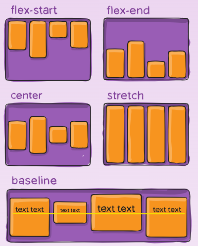

<script type="module">
  import mermaid from 'https://cdn.jsdelivr.net/npm/mermaid@10/dist/mermaid.esm.min.mjs';
  mermaid.initialize({ startOnLoad: true });
</script>

# **Desenvolvimento Web Básico**
## Aula 07 - Flexbox e Responsividade
Prof. Felipe Marx Benghi 
https://github.com/fbenghi/WebBasico2023-2


---

## Objetivos
- [ ] Características do desenvolvimento para mobile
- [ ] @media
- [ ] Flexbox

---
## Otimização para Móvel
Aqui estão algumas coisas que você deve ter em mente você cria seus designs móveis:
* **Mantenha simples**: Para acomodar telas menores e conexões mais lentas velocidades, reduza cada página para alguns itens e artigos principais. Os usuários estão procurando informações rápidas e óbvias de seus sites para celular.
* **Redimensione suas imagens**: Baixar várias imagens pode levar um dispositivo móvel a um arrastar. Reduza o número de imagens em seu design móvel e use gráficos pacote para redimensionar as imagens para que sejam otimizadas em qualidade e dimensionadas para um tamanho menor tela.
* **Role verticalmente**: Os leitores podem ler sua página com mais facilidade quando precisam apenas rolar verticalmente. *Limite-se a uma coluna de informações na orientação retrato e duas colunas em paisagem*.

---
## Otimização para Móvel

* **Torne seus links acessíveis**: Clicar em um pequeno link de hipertexto é extremamente difícil de fazer em um dispositivo móvel com interface touch screen. Crie links de hipertexto que sejam fácil de localizar e ativar.

Além disso: 
* **Teste seu site em diversos dispositivos e sob diferentes condições.**
O que funciona em um dispositivo pode falhar completamente em outro. Testar seu código em um computador desktop é apenas o primeiro etapa; você também pode precisar de acesso aos próprios dispositivos. Mesmo os emuladores não podem sempre capture as nuances envolvidas no desempenho de um dispositivo móvel real. 

---
# Exemplo de design ruim para Mobile


---
## Variação no tamanho das telas


---
## Pixel  

* Pixel CSS (px) - é uma unidade de comprimento que corresponde aproximadamente a largura ou altura de um ponto único que pode ser confortavelmente visto pelos olhos humanos sem esforço, mas é o menor possível
Por norma: 1 polegada / 96

* Pixel de dispositivo, que refere-se ao pixel físico real em uma tela.

O número de pixels do dispositivo correspondentes a um único pixel CSS é conhecido como **taxa de pixels do dispositivo**. 

---
## Regras CSS para diferente tamanho de telas

```CSS
@media only screen and (min-width: 481px) { 
 style rules
} 

```

---
## Regras CSS para diferente tamanho de telas

```CSS
/* Regras genéricas */ 
 style rules 
/* Estilos para mobile */ 
@media only screen and (max-width: 480px) { 
 style rules
} 
/* Estilo para tablets */ 
@media only screen and (min-width: 481px) { 
 style rules
} 
/* Estilos para Desktop */ 
@media only screen and (min-width: 769px) { 
 style rules
}
```
MOBILE FIRST! O design começa com estilos básicos que se aplicam a todos os dispositivos seguidos por regras de estilo específicas para dispositivos móveis.

---

# Exercício
Criar um menu seja:
* Na vertical quando para mobile
* Na horizontal e fixo para desktop

---


---
# Flexbox

---
## Por que Flexbox?
* No design responsivo é necessário estabelecer um layout diferente para cada tamanho de tela.
* É mais fácil ter uma especificação que se adapte automaticamente à largura da tela sem exigir um novo design de layout. Uma forma de conseguir isso é com `diplay:flex`.
* No modelo de layout flex os filhos podem ser dispostos em linhas ou colunas e tornam-se flexíveis para alterações no tamanho, distribuição e alinhamento


---
# Flexbox
Demonstração: https://flexbox.tech/

* Regras para o container:


* Regras para os itens contidos


---
# Flexbox - Regras container
1. Container do tipo flex

```CSS
display: flex;
```

---
# Flexbox - Regras container
2. Orientação

```CSS
  flex-direction: row | row-reverse;
```


```CSS
  flex-direction: column | column-reverse;
```


---


---
# Flexbox - Regras container
3. Transferência para uma nova linha (wrap)

```CSS
  flex-wrap: nowrap | wrap | wrap-reverse;
```


---
# Flexbox - Regras container
4. Alinhamento no eixo-secundário
```CSS
align-items: flex-start | flex-end | 
             center | stretch |
             baseline;
```

IMPORTANTE: Só funciona em conjunto com o `flex-wrap: nowrap`

---
## Flexbox - Regras Itens
1. Ordenação
Podemos trocar a ordem dos itens

```CSS
.item {
  order: 5; /* padrão é 0 */
}
```


---
## Flexbox - Regras Itens
2. Crescimento quando existir espaço livre

Por exemplo, se todos os itens tiverem `flex-grow` definido como 1, o espaço restante no container será distribuído igualmente para todos os filhos. Se um dos filhos tiver o valor 2, esse filho ocuparia o dobro do espaço de qualquer um dos outros (ou tentará, pelo menos).

```CSS
.item {
  flex-grow: 4; /* default 0 */
}
```


---
## Flexbox - Regras Itens
3. Tamanho padrão do item
Pode ser um comprimento (por exemplo, 20%, 5rem, etc.) ou uma palavra-chave.

* comprimento: define um valor absoluto, exemplo: 20%, 5rem, 100px.
* auto: veja minha propriedade de largura ou altura
* content: dimensione com base no conteúdo do item

```CSS
.item {
   flex-basis: | auto; /* padrão automático */
}

```
---
## Flexbox - Regras Itens
* Crescimento + Encolhimento + tamanho padrão


```css
flex: none | [ <'flex-grow'> <'flex-shrink'>? || <'flex-basis'> ]
```

---
# Exercício
Crie uma seção com 8 cards e controle o posicionamento usando flexbox.


---   
# Material de suporte
* Mozilla
https://developer.mozilla.org/en-US/docs/Web/CSS/CSS_Flexible_Box_Layout

* cod3rcursos
https://www.youtube.com/watch?v=s-CARPA01NU
https://github.com/cod3rcursos/youtube/tree/master/flexbox

* Tutoriais
https://css-tricks.com/snippets/css/a-guide-to-flexbox/

---
# Display
* inline: exibe um elemento como um elemento embutido (como `<span>`). Propriedades de altura e largura não terão efeito
* block: exibe um elemento como um elemento de bloco (como `<p>` ou `<div>`). Começa em uma nova linha e ocupa toda a largura
* inline-block: exibe um elemento como um contêiner de bloco em linha. O elemento em si é formatado como um elemento embutido, mas você pode aplicar valores de altura e largura
* none: não exibe o elemento

---
# Display

* flex: um modelo de layout unidimensional que possui layouts flexíveis e eficientes para organizar os itens dentro de um contêiner.
* grid: um modelo de layout bidimensional

---
## Grid
A propriedade display: grid transforma o elemento pai em um contêiner que possibilita a organização dos elementos filhos de forma bidimensional;
* No modelo de layout em grade os filhos podem ser dispostos no formato de linhas e colunas.


---
## Grid
Definindo o grip

```css
display: grid; // Define um grid
grid-template-columns: repeat(3, 1fr); // repita padrão por 3 colunas e ocupe 1 fr
grid-template-rows: repeat(4, 1fr); // repita padrão por 4 colunas e ocupe 1 fr
```

Importante: Fr é uma unidade fracionária e 1fr é para 1 parte do espaço disponível.

---
## Grid
Definindo o tamanho das células

```css
grid-column: 1 / 3; // ocupe a coluna 1 e vá até a coluna 3
grid-row: 1; // ocupe a linha 1
```

Importante: pode haver superposição
---
## Grid Referências

* https://developer.mozilla.org/en-US/docs/Web/CSS/CSS_grid_layout


* https://gridbyexample.com/examples/
---
# Flexbox vs Grid

* Para controlar layout por linha ou por coluna (unidimensional): flexbox. Um caso de uso ideal para o flexbox é quando você tem um conjunto de itens e 
deseja espaçá-los uniformemente em um contêiner;
* Para controlar layout por linha e coluna (bidimensional): grid layout. Ao usar grid layout, você cria um layout e então coloca os itens na posição que deseja das células da grade, ou permite que as regras de auto posicionamento coloquem os itens.


---

## Exercício:
1) Crie uma galeria de fotos a seu projeto
https://www.quackit.com/css/grid/examples/


---
# Exercício
Use flexbox para controlar o posicionamento de `aside` e `main` em mobile e  desktop


---
# FIM

