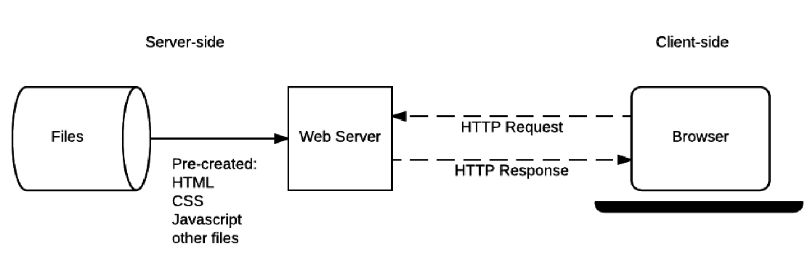
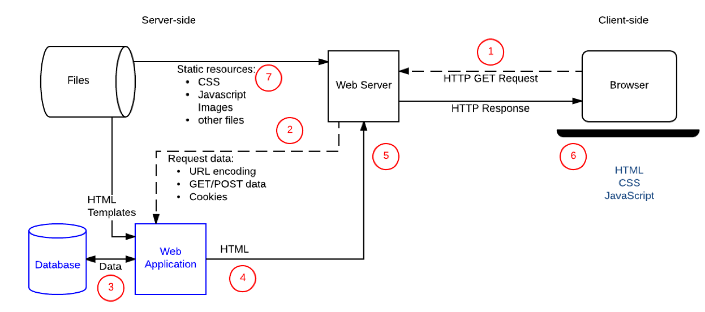
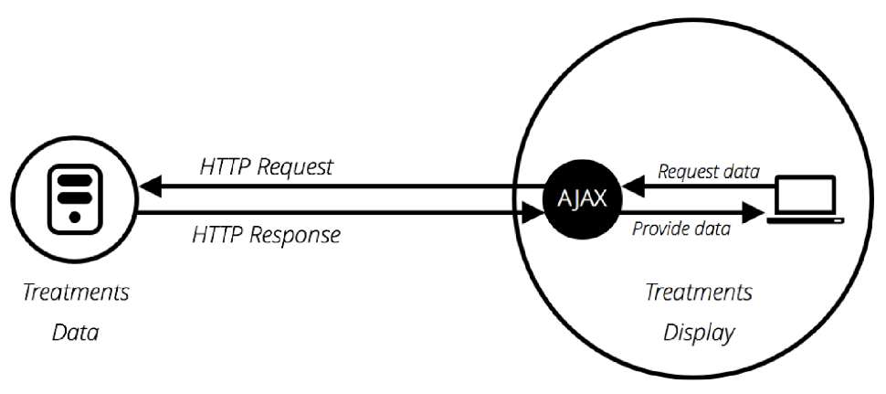
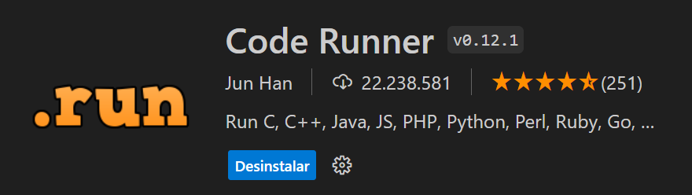

<script type="module">
  import mermaid from 'https://cdn.jsdelivr.net/npm/mermaid@10/dist/mermaid.esm.min.mjs';
  mermaid.initialize({ startOnLoad: true });
</script>

# **Desenvolvimento Web Básico**
## Aula 08 - Introdução ao Javascript (JS)
Prof. Felipe Marx Benghi 
https://github.com/fbenghi/WebBasico2023-2


---

## Objetivos
- [ ] Sites estáticos vs dinâmicos
- [ ] Introdução ao Javascript
- [ ] Javascript no navegador

---
## Sites estáticos


---
## Sites dinâmicos - Formato antigo

 
---
## Sites dinâmicos - Formato mais novo
### AJAX - Asynchronous Javascript And XML


> Permite que aplicações trabalhem de modo assíncrono, processando qualquer requisição ao servidor em segundo plano

---
### AJAX - Asynchronous Javascript And XML

* AJAX não é uma tecnologia!!!
* AJAX combina JavaScript, DOM (Document Object Model), CSS (Cascading Style Sheets) e XML para atualizar a interface do usuário sem recarregar a página inteira do navegador.
  * DOM (HTML): Templates das páginas
  * CSS: Estilo
  * Javascript: requisições ao servidor e personalização de templates
  * XML: transmissão de dados backend/frontend
* A aplicação se torna mais rápida e sensível às ações do usuário
* O JSON é mais utilizado que o XML devido às suas vantagens, como ser mais leve e ser parte do JavaScript. 
--- 

# Programando no VS Code em Javascript
Nome: Code Runner
Link do Marketplace do VS: https://marketplace.visualstudio.com/items?itemName=formulahendry.code-runner



---
## Script de demonstração

---
## Comparação entre C e Javascript
| Característica | Linguagem C | JavaScript |
| --- | --- | --- |
| **Tipagem** | Estática (fortemente tipada) | Dinâmica (fracamente tipada) |
| **Nível** | Baixo nível | Alto nível |
| **Criação** | Laboratórios Bell em 1980 | etscape em 1995 |
| **Aprendizado** | Desafiador para iniciantes | Relativamente fácil para iniciantes |
| **Velocidade** | Rápida | Lenta |
| **Uso** | Tudo, exceto web | Criado para páginas da web |
| **Execução** | Compilado e executado | Interpretado |

---
## Linguagens de Alto Nível vs Baixo Nível
* Linguagens de Alto Nível: São linguagens que se assemelham à linguagem humana, sendo muito mais legíveis para seres humanos. Elas são mais fáceis de entender e usar, mas oferecem menos controle direto sobre o hardware. Alguns exemplos são Python, Ruby, Perl, PHP e Java. Essas linguagens são muito mais intuitivas, amigáveis e mais fáceis de aprender, principalmente para iniciantes na área de programação3.

* Linguagens de Baixo Nível: São tipicamente linguagens que se assemelham mais à linguagem de máquina, como Assembly e C. Elas são mais complicadas, mas permitem um controle mais preciso da máquina. Estão mais próximas da linguagem de máquina.


---
## Linguagens Compiladas vs Interpretadas
* Linguagens Compiladas: Uma linguagem compilada é aquela em que o código-fonte é traduzido integralmente para código de máquina antes da execução. Isso significa que o programa é convertido em um formato que o computador pode executar diretamente. As linguagens compiladas tendem a ser mais rápidas e mais eficientes em sua execução do que as linguagens interpretadas. Exemplos de linguagens compiladas puras são C, C++, Erlang, Haskell, Rust e Go.

* Linguagens Interpretadas: Uma linguagem interpretada é aquela em que o código-fonte é executado linha por linha por um interpretador em tempo real. O interpretador lê e executa o código. Linguagens interpretadas, antigamente, eram significativamente mais lentas do que as linguagens compiladas. Exemplos de linguagens interpretadas comuns são PHP, Ruby, Python e JavaScript.

---
## Fortemente Tipada (estática) vs Fracamente Tipada (dinâmica)
Fortemente tipado descreve linguagens de programação que exigem que o tipo de dados de uma variável seja explicitamente definido e imposto pelo compilador. Isso significa que o compilador não permitirá que um programa seja executado se uma variável for usada de uma forma que não corresponda ao seu tipo de dados definido.

Por exemplo, se você declarar uma variável como um número inteiro, a linguagem fortemente tipada não permitirá que você a use como se fosse uma string sem uma conversão explícita.

Linguagens fortemente tipadas incluem Java, C++, Swift e Rust. Elas podem ajudar a prevenir erros de tipo, pois esses erros são detectados durante a compilação em vez de durante a execução

Linguagens fracamente tipadas não tem as restrições acima e permitem a troca de tipo durante a execução. Exemplos de linguagens fracamente tipadas JavaScript, PHP, Ruby, Python.

---
# Exercícios JS:
1. Calcule se um número é par ou ímpar.
1. Calcule o n elemento da sequência Fibonacci
1. Calcule a quantidade de caracteres em um texto
1. Crie um array com os dias da semana e imprima-os no console

---
# Como usar Javascript nas páginas WEB?

---
## Javascript no arquivo HTML

```Javascript
<script>
    console.log("Olá tudo bem");
</script>
```
## Arquivo de javascript
```Javascript
<script src="js/script.js"></script>
```
---
# Estrutura dos Projetos
```
project/
├── css/
|   └── style.css
├── js/
|   └── script.js
└── index.html
```
--- 
## Exercícios
1. Descubra se  o "par ou ímpar" no navegador
1. Crie um jogo de par ou ímpar no navegador, em que cada usuário possa inserir um valor e o resultado apareça na tela
1. Adicione uma função que verifique se os parâmetros de entrada do jogo de par ou ímpar são realmente números

---

# FIM

