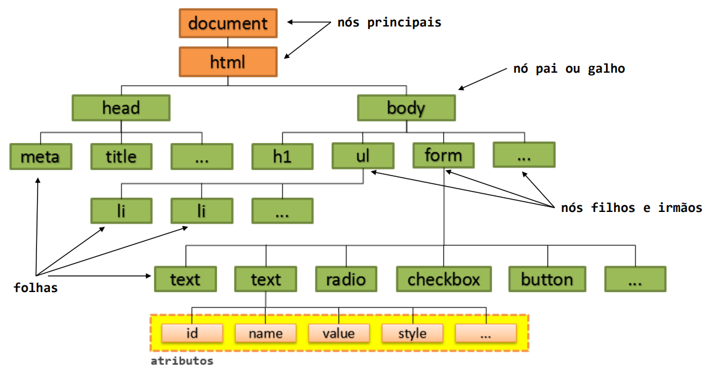
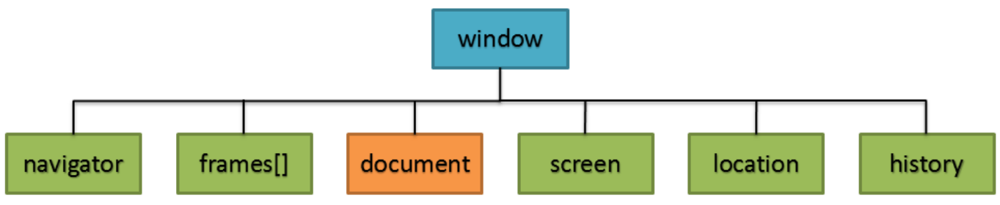

<script type="module">
  import mermaid from 'https://cdn.jsdelivr.net/npm/mermaid@10/dist/mermaid.esm.min.mjs';
  mermaid.initialize({ startOnLoad: true });
</script>

# **Desenvolvimento Web Básico**
## Aula 09 - DOM
Prof. Felipe Marx Benghi 
https://github.com/fbenghi/WebBasico2023-2


---

## Objetivos
- [ ] Acessando elementos HTML
- [ ] Editando elementos HML


---
## DOM


---
## Funções básicas DOM

```JS
document.getElementsByTagName ( ) ; // Busca pela Tag.
document.getElementsByClassName();  // Busca pela Class.        
document.getElementsByName( ) ;     // Busca pelo Name.
document.createElement();           // Adiciona um elemento.
document.removeChild ( );           // Remove um elemento.
document.appendChild() ;            // Substitui um elemento.
document.replaceChild();            // Cria um elemento HTML. 

```

---
## Browser Object Model (BOM)


```JS
window.navigator; // Informações sobre o navegador.        
window.frames;    // Quantidade de frames na página.
window.document;  // Document Object Model (DOM) . 
window.screen;    // Informações sobre a tela do usuário.
window.location;  // Define a pagina de navegação. 
window.history;   // Controla o histórico de navegação.     
```

---

## Funções básicas Window
```JS
window.alert();          // Informações ao usuário.
window.confirm() ;       // Confirmação Sim ou Não.
window.prompt ( ) ;      // Permite entrada ao usuário.
window.open ( ) ;        // Abre uma nova janela.
window.close();          // Fecha a janela corrente.
window.moveTo() ;        // Move a janela corrente.
window.resizeTo();       // Dimensiona a janela corrente.
window.innerHeight;      // Altura interna da janela. 
window.innerWidth;       // Largura interna da janela.
window.setInterval( ) ;  // Chama função a cada intervalo.         
window.clearInterval()   // Limpa intervalo. 
window.setTimeout();     // Chama função apenas uma vez.
window.clearTimeout ( ) ;// Limpa timeout.
```


---
## Exemplos de aplicação 1
```JS
// Encontra o elemento HTML
const main = document.querySelector("main") 

fetch("html/home.html")         // "Puxa" o arquivo html 
    .then(res => res.text())    // Converte o arquivo para texto 
    .then(texto => {
        main.innerHTML = texto; // Aplica o arquivo convertido em texto ao HTML
    });

```

---
## Exemplos de aplicação 2
```JS
// Encontra o elemento HTML
const menuHome = document.getElementById("menuHome");

// Cadastra um evento ON CLICK ao elemento HTML
menuHome.onclick = function(event)
{
    event.preventDefault();  // Impede que o clique do elemento HTML seja acionado
    fetch("html/home.html")  // Carrega uma página HTML
    .then(res => res.text())
    .then(texto => {
        main.innerHTML = texto; // Aplica o arquivo convertido em texto ao HTML
    });
}
```

---
## Exemplos de aplicação 3

```JS

fetch("cards.json")           // Carrega um arquivo do tipo JSON
    .then(res => res.json())  // Converte o arquivo para JSON
    .then(json => {
        // Variável de texto para armazenar elementos HTML
        let novosCards = "";

        // Encontra o elemento HTML que terá os cards
        const cardsHome = document.getElementById("cardsHome"); 

        // Percorre o JSON e mistura os dados com HTML
        for(card in json)
        {
            novosCards +=
            '<div class="subtopic">' +
            '<h3>' + json[card]['titulo'] + '</h3>' +
                json[card]['texto'] +
            '</div>';
        }

        // Aplica os novos Cards ao container
        cardsHome.innerHTML = novosCards;
    });
```
---
# FIM

