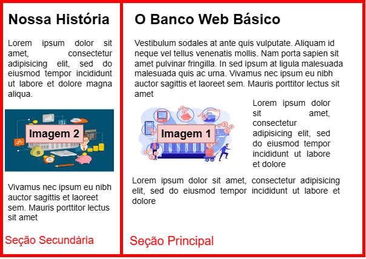
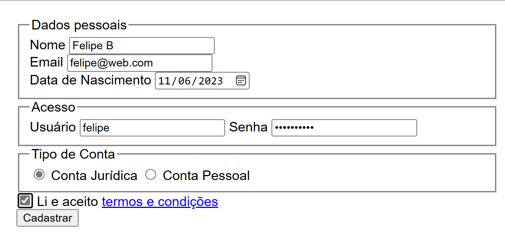
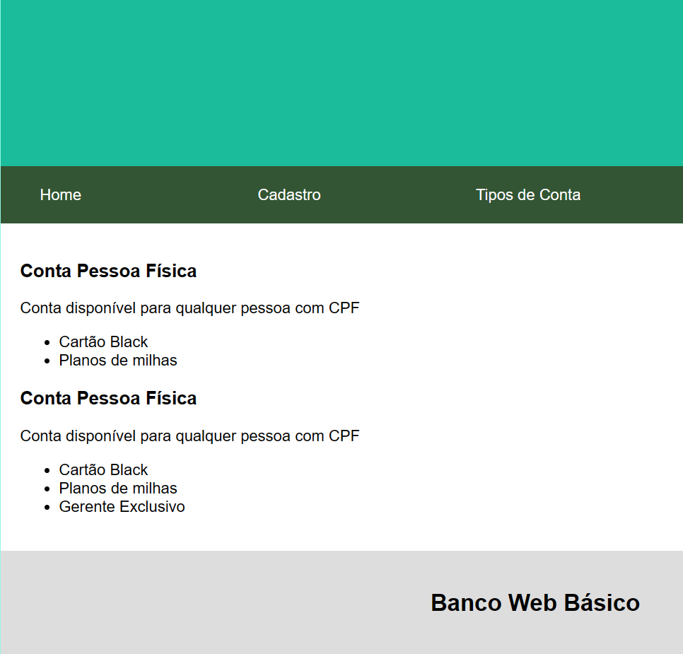

# **Desenvolvimento Web Básico**
## A1 - Prova Tipo 1
Prof. Felipe Marx Benghi 
    
## Instruções
* Utilize o projeto base fornecido
* Não é necessário fazer modificações nos scripts do servidor (`server.js`). Todas as mudanças devem ser feitas nos arquivos localizados dentro da pasta `express`
* Para executar servidor, utilize os comandos `npm install` e `npm start`
* A entrega deve consistir em um único arquivo .zip com todos os arquivos da pasta `express`. 

## [33%] Questão 1 - Tema: HTML/CSS + Mobile/Desktop
   
Programe a página `Home` conforme as imagens e instruções fornecidas.

**Modo Desktop**:
1. [4,12%] A página `Home` deve apresentar 2 colunas: 
    * Coluna Principal - `O Banco Web Básico`
    * Coluna Secundária - `Nossa história`  
    
    Observação: o conteúdo do texto é irrelevante
1. [4,12%] A `Imagem 1` deve ser exibida ao lado esquerdo da coluna, com texto ao lado direito
1. [4,12%] A `Imagem 2` deve ser exibida centralizada, sem texto a sua volta
1. [4,12%] A seção `Nossa história` deve ser exibida do lado esquerdo

    

**Mode Mobile**:
1. [4,12%] A página `Home` para Mobile deve apresentar UMA única coluna, com o mesmo conteúdo da página Desktop
1. [4,12%] A `Imagem 1` deve ser exibida centralizada, sem texto a sua volta
1. [4,12%] A `Imagem 2` deve ser exibida centralizada, sem texto a sua volta
1. [4,12%] A seção `Nossa história` deve ser exibida após a seção `O Banco Web Básico`

    

Nota: 
* Escolha qualquer imagem para `Imagem 1` e `Imagem 2`, desde que a estrutura requisitada para a página seja seguida. Precisa ser exibido uma imagem.
* Considere que uma tela `Mobile` tem até 480px de largura. Qualquer tela com largura superior deve ser considerada `Desktop`

## [33%] Questão 2 - Tema: Formulários HTML
1. [3%] Adicione um item `Cadastro` ao menu superior. Quando o usuário clicar neste novo item do menu, ele deve ser redirecionado a uma nova página
1. [20%] A nova página deve ter o formulário abaixo para o cadastro de um novo Usuário:

    

    O Formulário deve permitir ao usuário:   
    * Digitar seu `Nome`
    * Digitar seu `Email`
    * Selecionar uma `Data de Nascimento`
    * Digitar seu `Usuário` 
    * Digitar sea `Senha`
    * Selecionar entre `Conta Jurídica` **OU** `Conta Pessoal`
    * Aceitar os `Termos e Condições` de uso
    * Clicar em um link para os `Termos e Condições` de uso. Se clicado, redirecionar o usuário para `http://www.google.com`
    * Clicar em um botão para `Cadastrar` 

1. [10%] Ao clicar em `Cadastrar`, os valores preenchidos no formulário devem ser enviados ao servidor no endereço `/novousuario`, usando um comando `post` 

## [33%] Questão 3 - Tema: Javascript + Manipulação de DOM

1. [3%] Adicione um item `Tipos de conta` ao menu superior. Quando o usuário clicar neste novo item do menu, deve ser redirecionado a uma nova página.
1. [10%] A nova página deve carregar os dados a serem exibidos do servidor através do endereço http://localhost:3000/contas. Os dados recebidos estarão no seguinte formato:
    ```JSON
    {
        "contaPF" : 
        {
            "tipo": "Conta Pessoa Física",
            "descricao" : "Conta disponível para qualquer pessoa com CPF",
            "vantagens" : ["Cartão Black", "Planos de milhas"]
        },
        "contaPJ" : 
        {
            "tipo": "Conta Pessoa Jurídica",
            "descricao" : "Conta disponível para qualquer pessoa com CNPJ",
            "vantagens" : ["Cartão Black", "Planos de milhas", "Gerente Exclusivo"]
        }
    }
    ```
1. [20%] Os dados devem ser exibidos conforme a imagem abaixo:

    

