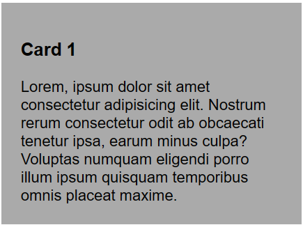
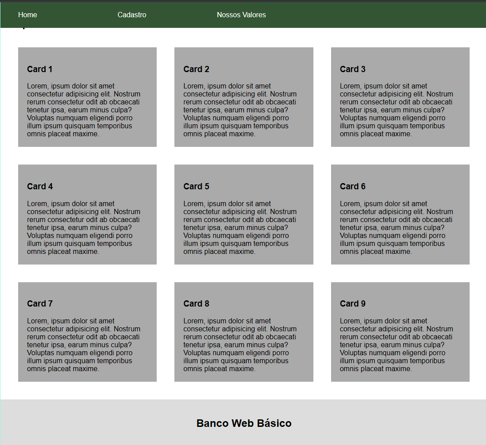
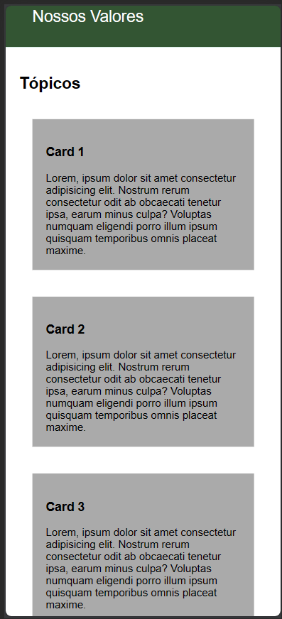
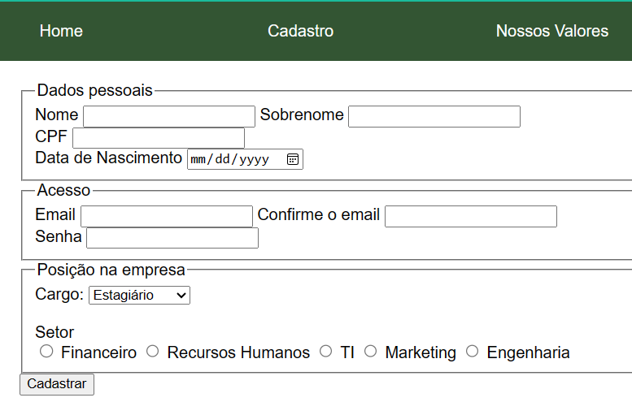
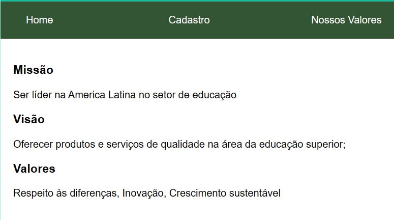

# **Desenvolvimento Web Básico - 2/2023**
## Prova Substitutiva
Prof. Felipe Marx Benghi 
    
## Instruções
* Utilize o projeto base fornecido
* A entrega deve consistir em um único arquivo .zip com todos os arquivos necessários

## [34%] Questão 1 - Tema: HTML/CSS + Mobile/Desktop
   
A página `Home` deve ter 9 `Cards` com título e texto, conforme o modelo abaixo:


    

1. [17%] Em Desktop, a página Home deve exibir os `Cards` em 3 colunas e 3 linhas:

    
1. [17%] Em Mobile, os `Cards` devem estar em 1 coluna e 9 linhas.

    


Notas:
* Conteúdo textual de Textos e Títulos é irrelevante
* Considere que uma tela `Mobile` tem até 480px de largura. Qualquer tela com largura superior deve ser considerada `Desktop`.


## [34%] Questão 2 - Tema: Formulários HTML
Na aba `Cadastro`, crie o formulário com a aparência abaixo



1. [24%] O Formulário deve permitir ao usuário:   
    * Digitar seu `Nome` e `Sobrenome` 
    * Digitar seu `CPF`
    * Selecionar uma `Data de Nascimento`
    * Digitar seu `Email` e confirmar seu `Email` 
    * Digitar sua `Senha`
    * Selecionar entre os cargos `Estagiário`, `Analista`, `Coordenador`, `Gerente`, `Diretor`
    * Escolher entre uma das opções de Setor: `Financeiro`, `Recursos Humanos`, `TI`, `Marketing`, `Engenharia`
    * Clicar em um botão para `Cadastrar` 

1. [10%] Ao clicar em `Cadastrar`, os valores preenchidos no formulário devem ser enviados ao servidor no endereço `/novoCadastro`, usando um comando do tipo `get` 

## [32%] Questão 3 - Tema: Javascript + Manipulação de DOM
A página `Nossos Valores` deve misturar os dados de um JSON com elementos HTML para ficar com a aparência abaixo:




```JSON
[
    {
        "titulo" : "Missão",
        "descricao" : "Ser líder na America Latina no setor de educação"
    },
    {
        "titulo" : "Visão",
        "descricao" : "Oferecer produtos e serviços de qualidade na área da educação superior;"
    },
    {
        "titulo" : "Valores",
        "descricao" : "Respeito às diferenças, Inovação, Crescimento sustentável"
    }

];
```

    

